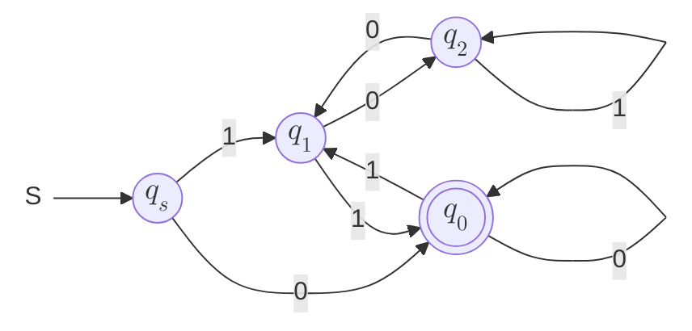
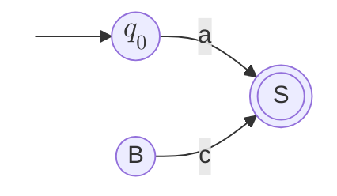
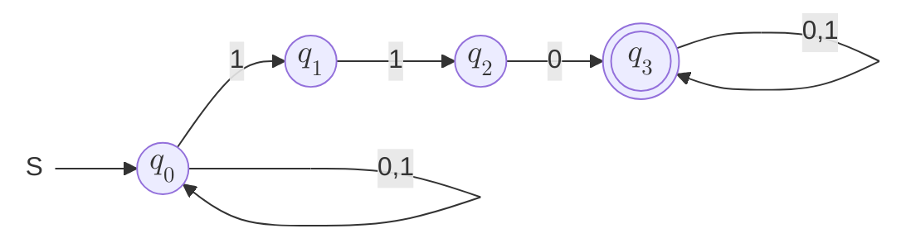
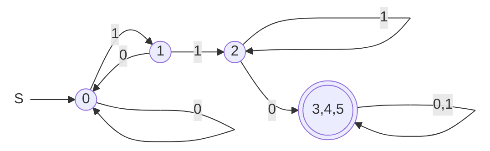

## 构造FA
**构造接收是3倍数的二进制串，高位先读。**

等价类：模3余数为 $i$ 的状态 $q_i$，初始状态为 $q_s$，接受状态为 $q_0$

$q_0$ 代表的等价类：$3k$
- 下一位为 0 时：$2(3k) + 0 = 6k$，模3余数为0，转移到 $q_0$
- 下一位为 1 时：$2(3k) + 1 = 6k + 1$，模3余数为1，转移到 $q_1$

$q_1$ 代表的等价类：$3k + 1$
- 下一位为 0 时：$2(3k + 1) + 0 = 6k + 2$，模3余数为2，转移到 $q_2$
- 下一位为 1 时：$2(3k + 1) + 1 = 3(2k + 1)$，模3余数为0，转移到 $q_0$

$q_2$ 代表的等价类：$3k + 2$
- 下一位为 0 时：$2(3k + 2) + 0 = 6k + 4$，模3余数为1，转移到 $q_1$
- 下一位为 1 时：$2(3k + 2) + 1 = 6k + 5$，模3余数为2，转移到 $q_2$

改：接收模3余1且模5余2的二进制串，高位先读。
只要设计等价类：$q_{ij}$（模3余i且模5余j）。

## 左线性文法到NFA
$S \to a | Bc$
关键在于：
1. 将 “a” 视为 “$q_0a$”（加入了一个初始状态）
2. 用“规约”的思想，反着看

## NFA到DFA
构建DFA：$\{x | x \in \{0,1\}^+ \text{且} x \text{中含形如110的子串}\}$
### 1. 构建NFA

这个题目有些简单，自己稍微改改就成DFA了。下面是机械的方式：

### 2. NFA转DFA
原理是NFA的状态组合得到DFA的状态，从头到尾模拟着走一遍NFA即可。
下表是逐行写的，右侧出现新状态就添加新行：

| 状态 | 输入0 | 输入1 | 新名称 |
| :----: | :--: | :--: | :---: |
| $[q_0]$ | $[q_0]$ | $\color{red}{[q_0, q_1]}$ 新状态 | 0 |
| $\color{red}{[q_0, q_1]}$ | $[q_0]$ | $[q_0, q_1, q_2]$ | 1 |
| $[q_0, q_1, q_2]$ | $[q_0, q_3]$ | $[q_0, q_1, q_2]$ | 2 |
| $[q_0, q_3]$ | $[q_0, q_3]$ | $[q_0, q_1, q_3]$ | 3 |
| $[q_0, q_1, q_3]$ | $[q_0, q_3]$ | $[q_0, q_1, q_2, q_3]$ | 4 |
| $[q_0, q_1, q_2, q_3]$ | $[q_0, q_3]$ | $[q_0, q_1, q_2, q_3]$ | 5 |

- 初始状态：$[q_0]$
- 接受状态：包含 $q_3$ 的状态

> 如果发现当前所有 NFA 状态都无法继续转移（没有定义），对应转移后 DFA 状态 $[\emptyset]$。该 DFA 状态无论输入什么都转移到自己，对应“陷阱状态”。
> 例如，不接收包含 $00$ 的 NFA 中，设“已经读取到第一个0”的状态为 $q_1$，只要不定义 $q_1$ 在输入0时的转移即可。此时转化为 DFA 会自动增加陷阱状态 $[\emptyset]$。

### 3. 最小化DFA
原理：把不可区分的状态合并。
**可区分的**：$\exist x \in \Sigma^*$ 使得 $\delta(q,x) \in F$ 和 $\delta(p,x) \in F$ 有且只有一个成立，则 $q$ 和 $p$ 是可区分的。

过程：
1. “终态”和“非终态”一定可以区分，先标记上（用`√`标记表示可区分）
2. 对没有标记的状态对正推，如果关联到的状态对已经标记了，那么就传染
3. 最终剩下的就是等价状态对

下表中，打勾的为可区分，打叉的为等价，写数对的为下一步可转移；终态用粗体表示；对称只写上三角。

|       | 0 | 1 | 2 | **3** | **4** | **5** |
| :----: | :--: | :--: | :--: | :--: | :--: | :--: |
|   0   | X | (1,2) | (0,3) | √ | √ | √ |
|   1   |   | X | (0,3) | √ | √ | √ |
|   2   |   |   | X | √ | √ | √ |
| **3** |   |   |   | X | (3,3) | (3,3) |
| **4** |   |   |   |   | X | (3,3) |
| **5** |   |   |   |   |   | X |

> 注意：`(0, 1)` 可以转移到 `(0, 0)` 和 `(1, 2)`，虽然 `(0, 0)` 不可区分，但是 `(1, 2)` 可区分（`(1, 2)` 可转移到 `(0, 3)`，被传染了可区分性），只要染上可区分就会被传染。

发现 $3 \equiv 4 \equiv 5$，合并为一个状态。

### 4. 得到DFA

## 正则文法和右线性文法的gap
正则文法的定义：只准有
- $A \to aB$
- $A \to a$

其中 $A, B \in V$，$a \in T^+$。容易证明其实可以限制 $a \in T$。

右线性文法的定义：只准有
- $A \to aB$
- $A \to a$

其中 $A, B \in V$，$a \in T^*$。

两者的区别在于正则文法要求 $a$ 至少是一个终结符，而右线性文法允许 $a$ 是空串 $\epsilon$。显然，正则文法的变量不能“总是”派生出空串，而右线性文法可以；正则文法是右线性文法的一个子集。

但这不影响两者的等价性。等价性的证明为：给出任意一方，可以构造出接收同一语言的另一方。要弥补双方的差异，只需要找到可以接收空串正则文法。关键：将 $\epsilon$ 作为构造的正则文法的一个终结符。

所以此时构建出的正则文法的形式描述是和右线性文法不一样的。子集是语法层面的子集，但等价是语言层面的等价。

## 证明不是RL
### pumping lemma 泵引理
**证明** $L = \{0^m1^n | m \neq n\}$ **不是RL：**
1. 假设它是RL，那么存在一个 pumping length $N$。
2. 取 $m = N$，则 $z = 0^N1^{n}$.
3. 任意划分：$\forall j \in [0, N), \forall k \in [1, N-j] $（$j$ 是为了满足 $|uv| \leq N$，$k$ 是为了满足 $|v| \geq 1$，两个一起实现了**任意划分**），进行如下划分：
    - $u=o^{N-j-k}$
    - $v=o^k$
    - $w=0^j1^n$
    此时 $uv^iw = 0^{N+k(i-1)}1^n, i \geq 0$
4. 要证明不是RL，只要找到 $i$ 使得 $uv^iw \notin L$ 即可。此时 $i=\frac{n-N}{k}+1$ 存在，即要求 $n-N$ 是 $k$ 的倍数，问题变为找到这样的 $n$。考虑到 $k \leq N$，取 $n-N = N!$ 即可。

### 利用封闭性
仍然对上一题：
1. 已知 $A = \{0^n1^n\}$ 不是RL、 $C = \{0^*1^*\}$ 是RL。
2. 若 $L$ 是 RL，根据运算封闭性，$C - L$ 也是RL，但这实际上得到了非RL的 $A$，矛盾，所以 $L$ 不是RL。

## 转换为CNF
**构造与下列文法等价的CNF文法:**
- $S \to aBB | bAA$
- $A \to bbA | \epsilon$
- $B \to aBa | aa | \epsilon$

机械做法为：先化简CFG，然后转变为CNF。

### 1. 消除 ε-产生式
观察到 $A$ 和 $B$ 都有 $\epsilon$-产生式，所以需要消除它们。只要将这两个变量出现的地方分裂为“X非空”和“X为空”两种情况，代入即可。
- $S \to aBB | aB | a | bAA | bA | b$
- $A \to bbA | bb$
- $B \to aBa | aa$

### 2. 消除单变量产生式
没有单变量产生式。

### 3. 去无用符号
#### 3.1 从后向前：从终极符串出发逆推
终极符串有`a` `b` `aa` 和 `bb`，所以都是有用的。

#### 3.2 从前向后：从开始符号出发正推
从 $S$ 出发可以推导出 $A$ 和 $B$，所以它们都是可达的。

#### 补充一个例题
**删除下列文法中的无用符号:**
- $S \to AB | CA | a$
- $A \to a$
- $B \to BC | AB | DE | d$
- $C \to aB | b$

先从后向前：终极符串有 `a` `b` 和 `d`，所以 $S A B C$ 都有用；剩下 $D$ 和 $E$ 没有派生，删除，得到：
- $S \to AB | CA | a$
- $A \to a$
- $B \to BC | AB | d$
- $C \to aB | b$

然后从前向后：从 $S$ 出发可以推导出 $A$、$B$ 和 $C$，所以它们都是可达的。

### 4. 调整为 CNF 的形式
只允许右侧要么是两个变量、要么是一个终极符。
先把终极符串解决：原本的 $A$、$B$ 名称变为 $X$ 和 $Y$，功能变为派生单个终极符：
- $S \to AYY | AY | a | BXX | BX | b$
- $X \to BBX | BB$
- $Y \to AYA | AA$
- $A \to a$
- $B \to b$

再把多变量串解决——引入新的变量：
- $A_Y \to AY$
- $B_X \to BX$
- $S \to A_YY | AY | a | B_XX | BX | b$
- $X \to BB_X | BB$
- $Y \to A_YA | AA$
- $A \to a$
- $B \to b$

## 上下文无关语言的构造
**构造产生0和1数目相同、且非空串的文法（上下文无关语言）:**
- $S \to 0B | 1A$: B 表示1要多一个，A 表示0要多一个
- $B \to 1 | 1S | 0BB$
- $A \to 0 | 0S | 1AA$

> 一个错误解法：
> $S \to 1X0 | 0X1 | 01X | 10X | X01 | X10$
> 因为产生不了 `000111111000`

---

**构造接收** $L = \{1^n0^{2n} | n \geq 1\}$ **的PDA:**
- 状态：$q_0$（记忆状态），$q_1$（读了第一个0），$q_2$（读了第二个0），$q_f$（接受状态）
- 输入字母表：$\{0, 1\}$
- 栈字母表：$\{Z, A\}$（$Z$ 是初始栈符号，$A$ 用来记忆读了多少个1）
- 转移函数：
    - $\delta(q_0, 1, Z) = \{(q_0, AZ)\}$
    - $\delta(q_0, 1, A) = \{(q_0, AA)\}$
    - $\delta(q_0, 0, A) = \{(q_1, A)\}$ 读了第一个0
    - $\delta(q_1, 0, A) = \{(q_2, \epsilon)\}$
    - $\delta(q_2, 0, A) = \{(q_1, A)\}$ 读了奇数个0
    - $\delta(q_2, \epsilon, Z) = \{(q_f, \epsilon)\}$ 空栈和终态同时接收

## 图灵机
**计算阶乘：输入为 $n$ 个 0，输出 为 $n!$ 个 0。**
基本思路：
$$
\begin{aligned}
n! &= [n \times (n-1) \times ... \times i] \times i \times ... \times 2\\
&= [result + result \times (i-1)] \times ... \times 2\\
result_0 &= 1\\
result_t &= result_{t-1} \times (n - t + 1), 1 \leq t < n \\
&= result_{t-1} + result_{t-1} \times (n - t)
\end{aligned}
$$
1. 先在末尾加上 `10`，回到开头。
2. 消去一个输入的 `0`，在遇到 `1` 之前，每次读取到一个 `0`，就把后面的内容复制到最后
3. 遇到 `1` 开始返回。
3. 如果没有 `0` 可以消去（遇到的是 `1`）则直接把 `1` 改为空，进入终止状态

追加的时候有些小技巧，比如暂时用 `X` 标记已经读取的，`Y` 标记已经追加的，最后统一变为 `0`。

| $\delta$ | 0 | 1 | B | X | Y | 解释 |
| :--: | :--: | :--: | :--: | :--: | :--: | :-- |
| $q_0$ | $(q_0,0,R)$ | $(q_0,0,R)$ | $(q_1,1,R)$ |  |  | 到末尾加1 |
| $q_1$ | | | $(q_{b},0,L)$ | |  | 加0后回头 |
| $q_{b}$ | $(q_{b},0,L)$ | $(q_{b},1,L)$ | $(q_2,B,R)$ | $(q_{b},0,L)$ | $(q_{b},0,L)$ | 到开头(back) 顺别负责将X和Y置为0 |
| $q_2$ | $(q_3,B,R)$ | $(q_f,B,R)$ | | | | 消去第一个0，开始乘法 遇到1说明没0了，结束 | 
| $q_3$ | $(q_4,X,R)$ | $(q_{e},1,R)$ | | | | 已读取，准备追加 遇到1说明本轮乘法结束 先把X和Y置为0再开启下一轮 |
| $q_{e}$ | $(q_{e},0,R)$ | $(q_{e},1,R)$ | $(q_{b},B,L)$ | $(q_{end},X,R)$ | $(q_{e},Y,R)$ | 到末尾(end) |
| $q_4$ | $(q_4,0,R)$ | $(q_5,1,R)$ | | | | 找到第一个输出位置 |
| $q_5$ | $(q_6,X,R)$ | | | | $(q_7,Y,L)$ | 读取一个输出的0 读到Y说明复制完了 |
| $q_6$ | $(q_6,0,R)$ | | $(q_{b2},Y,L)$ | | $(q_6,Y,R)$ | 读一个就尾部复制一个 |
| $q_{b2}$ | $(q_{b2},0,L)$ | | | $(q_5,X,R)$ | $(q_{b2},Y,L)$ | 回到输入的第一个0继续复制 |
| $q_7$ | | $(q_8,1,L)$ | | $(q_7,0,L)$ | | 向左将输出的X变为0 回到输入侧 |
| $q_8$ | $(q_8,0,L)$ | | | $(q_3,X,R)$ | | 到输入最左侧开始下一轮追加 |

模拟 $3!=6$：
| 序号 | 状态 | 序号 | 状态 | 序号 | 状态 |
| :--: | :-- | :--: | :-- | :--: | :-- |
| 1 | $\underset{q_0}{0}00BB$      | 2 | $000 \underset{q_0}{B}B$     | 3 | $000 1 \underset{q_1}{B}$    |
| 4 | $000 \underset{q_{b}}{1} 0$  |   | 乘2 | | 乘1 |
| 5 | $\underset{q_{b}}{B}00010$   | 33 | $\underset{q_{b}}{B}001000$ | 56 | $\underset{q_b}{B}01000000$ |
| 6 | $\underset{q_2}{0}0010$      | 34 | $\underset{q_2}{0}01000$    | 57 | $\underset{q_2}{0}100000$   |
| 7 | $B\underset{q_3}{0}010$      | 35 | $B\underset{q_3}{0}1000$    | 58 | $B\underset{q_3}{1}000000$  |
| 8 | $X\underset{q_4}{0}10$       | 36 | $X\underset{q_4}{1}000$     | 59 | $1\underset{q_{e}}{0}00000$ |
| 9 | $X0\underset{q_4}{1}0$       | 37 | $X1\underset{q_5}{0}00$     | 60 | $100000\underset{q_{b}}{0}$ |
| 10 | $X01\underset{q_5}{0}$      | 38 | $X1X\underset{q_6}{0}0$     | 61 | $\underset{q_2}{1}000000$   |
| 11 | $X01X\underset{q_6}{B}$     | 39 | $X1X00\underset{q_6}{B}$    | 62 | $B\underset{q_f}{0}00000$   |
| 12 | $X01\underset{q_{b2}}{X}Y$  | 40 | $X1X0\underset{q_{b2}}{0}Y$ | 答 | $000000 = 6$ |
| 13 | $X01X\underset{q_5}{Y}$     | 41 | $X1X\underset{q_5}{0}0Y$    |
| 14 | $X01\underset{q_7}{X}Y$     | 42 | $X1XX\underset{q_6}{0}Y$    |
| 15 | $X0\underset{q_7}{1}0Y$     | 43 | $X1XX0Y\underset{q_6}{B}$   |
| 16 | $X\underset{q_8}{0}10Y$     | 44 | $X1XX0\underset{q_{b2}}{Y}Y$|
| 17 | $\underset{q_8}{X}010Y$     | 45 | $X1XX\underset{q_5}{0}YY$   |
| 18 | $X\underset{q_3}{0}10Y$     | 46 | $X1XXX\underset{q_6}{Y}Y$   |
| 19 | $XX\underset{q_4}{1}0Y$     | 47 | $X1XXXYYY\underset{q_6}{B}$ |
| 20 | $XX1\underset{q_5}{0}Y$     | 48 | $X1XXXY\underset{q_{b2}}{Y}Y$ |
| 21 | $XX1X\underset{q_6}{Y}$     | 49 | $X1XXX\underset{q_5}{Y}YY$  |
| 22 | $XX1XY\underset{q_6}{B}$    | 50 | $X1XX\underset{q_7}{X}YYY$  |
| 23 | $XX1X\underset{q_{b2}}{Y}Y$ | 51 | $X\underset{q_7}{1}000YYY$  |
| 24 | $XX1\underset{q_{b2}}{X}YY$ | 52 | $\underset{q_8}X1000YYY$    |
| 25 | $XX1X\underset{q_5}{Y}Y$    | 53 | $X\underset{q_3}{1}000YYY$  |
| 26 | $XX1\underset{q_7}{X}YY$    | 54 | $X1\underset{q_{e}}{0}00YYY$|
| 27 | $XX\underset{q_7}{1}0YY$    | 55 | $X1000YY\underset{q_{b}}{Y}$|
| 28 | $X\underset{q_8}{X}10YY$    | 
| 29 | $XX\underset{q_3}{1}0YY$    |
| 30 | $XX1\underset{q_{e}}{0}YY$  |
| 31 | $XX10Y\underset{q_{b}}{Y}$  |
| 32 | $XX10\underset{q_{b}}{Y}0$  |

可以看到复杂度还是很高的。主要是不能随机跳转。实际上 `Y` 可以用 `1` 代替，不过为了过程的清晰还是没有复用。