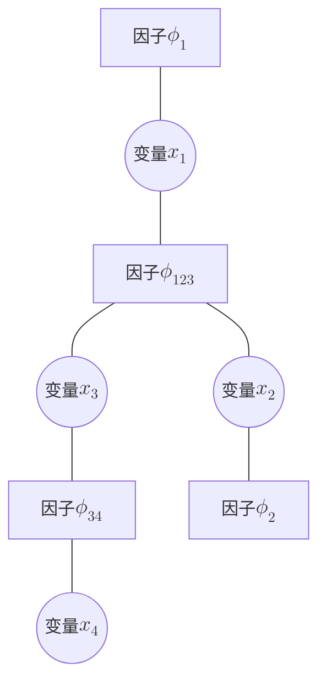

> 是阅读论文《Neural Belief Propagation Auto-Encoder for Linear Block Code Design》需要的前置知识。 
> 主要参考：https://www.zhangzhenhu.com/probability_model/8.消元法.html

在一般有向概率图下，观测到某节点集A的状态，求某节点B的状态的分布，基本做法是：
1. 求P(B, A)，也就是边缘概率分布
    - 边缘概率分布的求法是对联合概率分布求积分，把其他变量全部积掉。由于概率图的“马尔可夫性”（也就是只依赖相连的节点），因此最终可以转变为一系列积分的乘积
    - 注意不应该把A积掉。不过换种形式就可以了：假设 $x_i$ 是变量，而 $\bar{x}_i$ 是观测值，定义 $\delta(x_i, \bar{x}_i) = (x_i == \bar{x}_i) ? 1 : 0$ 表示变量 $x_i$ 是否为观测值。乘上这一项就可以用求和了，其作用相当于提取。
2. 求P(B|A)，只要除以P(A)，P(A) 可以由 P(B, A) 将B积掉得到

对于无向图，也就是用“势函数”和“归一化因子”代替了概率，做法同理。

该方法叫做“消元法”。问题是计算太复杂。如果要计算节点集合C的状态分布，则每个都要从头开始计算，效率极低。但是很多运算都是重复的。因此需要找一种方法“复用”。这个方法就是树结构下的“加和乘积算法(sum-product algorithm)”，又称为置信传播(belief propagation)算法。（在树形结构上是精确的，在环上是近似的，但实际效果也还不错）

基本思想是：对于某个节点，先收集了各个邻居的信息，如果是上游的节点需要计算概率，就把自己下游的信息向上传递；如果是下游的节点需要，则把自己的上游信息向下传递。也就是不需要再深入积分了，已经预计算了。
这里用“传递”其实不对，因为当每个节点都收集了全部的信息时，直接拿来用就是了。

换个数学一些的表述：节点x的邻居节点集合为N(x)，如果 $y\in N(x)$ 需要计算，则需要把信息 $message_{N(x) \setminus y}$ 传递给 y。y接收了这个信息就存下来了（这是传播过程），如果真的要计算y的概率，直接拿来用（推理时）。

传递的“消息”就是这棵树某个末端的边缘概率。传递的顺序为：如果某节点x就差邻居y的信息没收到了，则把其他节点的信息汇总发给y。

下面引入“因子图”的概念。用无向图解释。无向图里势函数是定义在最大团上的，比如三个变量节点构成的团是一个三角形相互依赖。这就不是树形了，解决方法是引入“因子节点”，也就是将三角转换为星形，中心为“因子节点”。因子节点的邻居构成团。

“（广义）星三角变换”后就可以是树了。此时同类节点之间没有边，邻居都是异类。下面具体给出传递的消息是什么：
- 变量i传递给因子j的消息 $v_{ij}(x_i)$：也就是屏蔽了节点i往外的节点（积分积掉了）的概率。而这个概率是其 其余的邻居 $N(i) / j$ 给他的。因此值为：
    $$
    v_{ij}(x_i) = \prod_{k \in N(i) \setminus j} u_{ki}(x_i)
    $$

- 因子j传递给变量i的消息 $u_{ji}(x_i)$ ：也就是这个团中其他节点信息的汇总，要把别的节点积分积掉：
    $$
    u_{ji}(x_i) = \sum_{x_{N(j) \setminus i}} \left(\phi_j(x_{N(j)}) \prod_{k \in N(j) \setminus i} v_{kj}(x_k) \right)
    $$

## 举个例子

假设现在已经知道了 $x_4$ 和 $x_2$ 的观测量 $o_4$ 和 $o_2$，求 $x_1$ 的概率。先用基本的消元法：
$$
\begin{aligned}
p(x_1, x_2 = o_2, x_4 = o_4) &= \frac{1}{Z} \sum \limits_{x_2, x_3, x_4} \phi_1(x_1) \phi_2(x_2) \delta(x_2, o_2) \phi_{34}(x_3, x_4) \delta(x_4, o_4) \phi_{123}(x_1, x_2, x_3) \\
&= \frac{\phi_1(x_1)}{Z} \sum \limits_{x_3} \left(\sum \limits_{x_4}\phi_{34}(x_3, x_4) \delta(x_4, o_4)\right) \left(\sum \limits_{x_2} \phi_2(x_2) \delta(x_2, o_2) \phi_{123}(x_1, x_2, x_3) \right)
\end{aligned}
$$

消元法最终公式就是这样，比较复杂。下面写成消息的形式：

$x_1$ 接收来自 $\phi_{123}$ 的消息，根据定义，需要先得到 $x_3$ 和 $x_2$ 传递给 $\phi_{123}$ 的消息：
$$
\begin{aligned}
u_{\phi_{34}\to x_3}(x_3)=\sum \limits_{x_4}\phi_{34}(x_3, x_4)\delta(x_4, o_4) \\
v_{x_2\to \phi_{123}}(x_2)=u_{\phi_2 \to x_2}(x_2) = \phi_2(x_2)\delta(x_2, o_2)
\end{aligned}
$$

于是，因子 $\phi_{123}$ 传给 $x_1$ 的消息为：
$$
u_{\phi_{123}\to x_1}(x_1)=\sum \limits_{x_2, x_3}\phi_{123}(x_1, x_2, x_3)\,v_{x_2\to \phi_{123}}(x_2)\,u_{\phi_{34}\to x_3}(x_3)
$$

发现和消元法求和内容一致。于是得到边缘概率分布：
$$
p(x_1, o_2, o_4) = \frac{\phi_1(x_1)}{Z} u_{\phi_{123}\to x_1}(x_1)
$$

最终：
$$
\begin{aligned}
p(x_1 = e_1 | x_2=o_2, x_4=o_4) &= \frac{p(e_1, o_2, o_4)}{p(o_2, o_4)} \\
&= \frac{p(e_1, o_2, o_4)}{\sum \limits_{x_1} p(x_1, o_2, o_4)} \\
&= \frac{\phi_1(e_1) u_{\phi_{123}\to x_1}(e_1)}{\sum \limits_{x_1} \phi_1(x_1) u_{\phi_{123}\to x_1}(x_1)}
\end{aligned}
$$

## 对数似然比(LLR)消息
在LDPC解码中，信念传播的输入是电压这种实际采样的连续值，输出是判决后的二值，这个过程中进行了一些纠错。通常内部需要多次迭代，每次迭代后检查Hx，如果是0就完成，如果不是代表还可以继续纠错，继续迭代。直到最大迭代次数，如果还不是0，说明猜不出了，只能报错，通过重传等机制弥补。

> 为什么LDPC需要迭代？因为有环。完美树形结构不需要迭代

首先变量是二值的。然后定义LLR类型的消息：
$$
L(u_{ij}) = \ln \frac{u_{ji}(x_i=0)}{u_{ji}(x_i=1)}
$$
表示对 $x_i$ 取值的建议。

理想情况下线性分组码解码时：$Hx = 0$，里面进行的是模2加法，也就是选几个比特进行异或，结果是0。因子节点就是定义了这样一个规则：如果因子节点的邻居的异或为0，则势函数为1；否则为0。

$u_{ji}(x_i=0)$ 的意思是：若 $x_i=0$，那么校验方程j成立（相连比特异或为0）的概率。$L(u_{ij})$ 给出了完全不知道 $x_i$ 实际取值情况下，为了满足校验方程时，对 $x_i$ 的建议，符号代表数值，绝对值代表建议的强烈程度。$x_i$ 有实际值L（也是对数似然比），和建议一致（同号）那非常完美，可以确定取值。如果和建议相悖，看加起来的符号。如果拉不回来，那么Hx大概也会不为0，说明这种情况已经超过了纠错上限。

对于节点向因子传递的消息：
$$
\begin{aligned}
v_{ij}(x_i) = \prod_{k \in N(i) \setminus j} u_{ki}(x_i)\\
L(v_{ij}) = \sum_{k \in N(i) \setminus j} L(u_{ki})
\end{aligned}
$$

对于因子向节点传递消息：
$$
\begin{aligned}
u_{ji}(x_i) = \sum_{x_{N(j) \setminus i}} \left(\phi(x_{N(j)}) \prod_{k \in N(j) \setminus i} v_{kj}(x_k) \right) \\
u_{ji}(x_i = 0) = \sum_{x_{N(j) \setminus i}} \left(\phi(x_{N(j)\setminus i}, 0) \prod_{k \in N(j) \setminus i} v_{kj}(x_k) \right) \\
u_{ji}(x_i = 1) = \sum_{x_{N(j) \setminus i}} \left(\phi(x_{N(j)\setminus i}, 1) \prod_{k \in N(j) \setminus i} v_{kj}(x_k) \right)
\end{aligned}
$$

设 $S = \bigoplus_{k \in N(j) \setminus i} x_k$ 为除 $i$ 以外所有邻居的异或和。

- 当 $x_i = 0$ 时，为了满足总异或和为 0，必须要求 $S = 0$。
- 当 $x_i = 1$ 时，同上，要求 $S = 1$。
- 此时 $\phi(x_{N(j)\setminus i}, x_i) = 1$

因此，求和公式可以具体写为（为了简洁，省略下标 $kj$，用 $v_k(x_k)$ 表示）：

$$ u_{ji}(0) = \sum_{\mathbf{x}_{N\setminus i} : \bigoplus x_k = 0} \prod_{k} v_k(x_k) $$
$$ u_{ji}(1) = \sum_{\mathbf{x}_{N\setminus i} : \bigoplus x_k = 1} \prod_{k} v_k(x_k) $$

构造“和”与“差”。这是推导中最关键的一步。我们不直接算 $u(0)$ 和 $u(1)$，而是算它们的和与差。

- 两者之和（所有情况的总和）
    $$ u_{ji}(0) + u_{ji}(1) = \sum_{\text{all } \mathbf{x}} \prod_{k} v_k(x_k) $$
    由于求和是对所有可能的组合，乘积可以拆开：
    $$ u_{ji}(0) + u_{ji}(1) = \prod_{k} \left( v_k(0) + v_k(1) \right) $$

- 两者之差（利用符号 trick）
    考虑这样一个乘积：$\prod_{k} (v_k(0) - v_k(1))$。
    当我们把这个乘积展开时，每一项都是从括号里选一个数相乘。
    - 如果我们选了 $v_k(0)$，符号是正的。
    - 如果我们选了 $v_k(1)$，符号是负的。

对于任意一种组合 $\mathbf{x}$，如果其中包含偶数个 1（即 $\bigoplus x_k = 0$），那么负号出现了偶数次，结果为**正**。
如果包含奇数个 1（即 $\bigoplus x_k = 1$），那么负号出现了奇数次，结果为**负**。

所以，这个乘积展开后正好等于“偶校验项之和”减去“奇校验项之和”：
$$ u_{ji}(0) - u_{ji}(1) = \prod_{k} \left( v_k(0) - v_k(1) \right) $$

### 3. 引入 LLR 和 tanh

现在我们要计算 $L(u_{ji}) = \ln \frac{u_{ji}(0)}{u_{ji}(1)}$。
利用上面的和与差，我们可以构造出比值。

首先，观察单个变量 $k$ 的项：
令 $L_k = \ln \frac{v_k(0)}{v_k(1)}$，则 $\frac{v_k(0)}{v_k(1)} = e^{L_k}$。

我们来看 $\frac{v_k(0) - v_k(1)}{v_k(0) + v_k(1)}$ 等于什么：
$$ \frac{v_k(0) - v_k(1)}{v_k(0) + v_k(1)} = \frac{\frac{v_k(0)}{v_k(1)} - 1}{\frac{v_k(0)}{v_k(1)} + 1} = \frac{e^{L_k} - 1}{e^{L_k} + 1} $$

根据双曲函数公式，这正是 $\tanh(L_k / 2)$：
$$ \tanh\left(\frac{L_k}{2}\right) = \frac{e^{L_k} - 1}{e^{L_k} + 1} $$

### 4. 综合推导

现在回到 $L(u_{ji})$。
我们计算 $\frac{u_{ji}(0) - u_{ji}(1)}{u_{ji}(0) + u_{ji}(1)}$：

$$ \frac{u_{ji}(0) - u_{ji}(1)}{u_{ji}(0) + u_{ji}(1)} = \frac{\prod_{k} (v_k(0) - v_k(1))}{\prod_{k} (v_k(0) + v_k(1))} = \prod_{k} \left( \frac{v_k(0) - v_k(1)}{v_k(0) + v_k(1)} \right) $$

代入刚才的 $\tanh$ 结论：
$$ \frac{u_{ji}(0) - u_{ji}(1)}{u_{ji}(0) + u_{ji}(1)} = \prod_{k} \tanh\left(\frac{L_k}{2}\right) $$

另一方面，对于输出端，令 $L_{out} = L(u_{ji})$，同样有：
$$ \frac{u_{ji}(0) - u_{ji}(1)}{u_{ji}(0) + u_{ji}(1)} = \frac{\frac{u_{ji}(0)}{u_{ji}(1)} - 1}{\frac{u_{ji}(0)}{u_{ji}(1)} + 1} = \frac{e^{L_{out}} - 1}{e^{L_{out}} + 1} = \tanh\left(\frac{L_{out}}{2}\right) $$

### 5. 最终结果

联立上面两式：

$$ \tanh\left(\frac{L_{out}}{2}\right) = \prod_{k \in N(j) \setminus i} \tanh\left(\frac{L_k}{2}\right) $$

两边同时取反双曲正切 $\text{artanh}$（即 $\tanh^{-1}$），并乘以 2：

$$ L(u_{ji}) = 2 \cdot \text{artanh} \left( \prod_{k \in N(j) \setminus i} \tanh\left(\frac{L(v_{kj})}{2}\right) \right) $$

这就是论文中 Check Node 更新公式的完整由来。