我要介绍的论文是 From Multimodal LLMs to Generalist Embodied Agents: Methods and Lessons，是 Apple CVPR2025 的工作。
这篇论文是讲构建通用具身智能体的，很有工程意义和参考价值。

# 研究问题
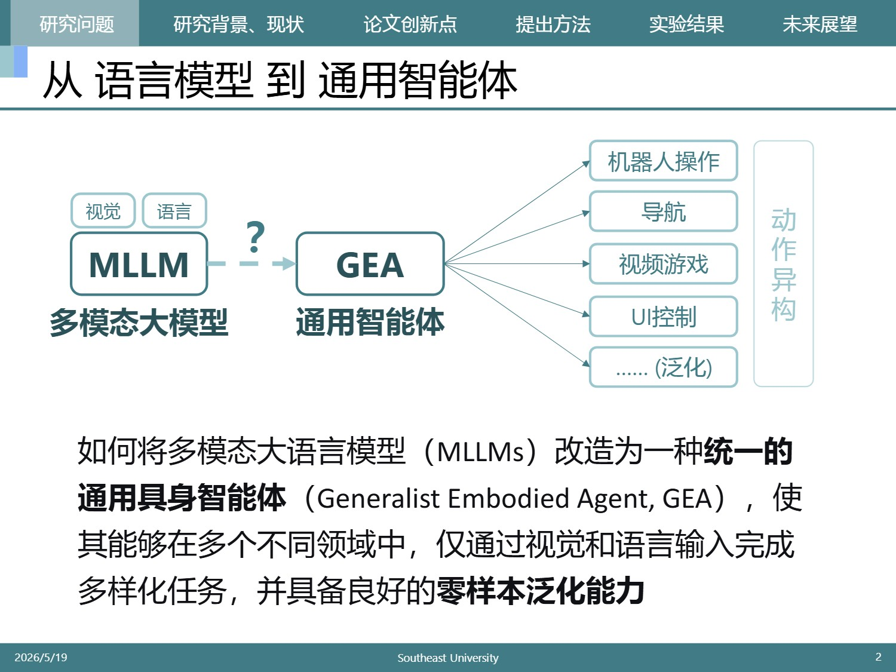

# 研究背景、现状
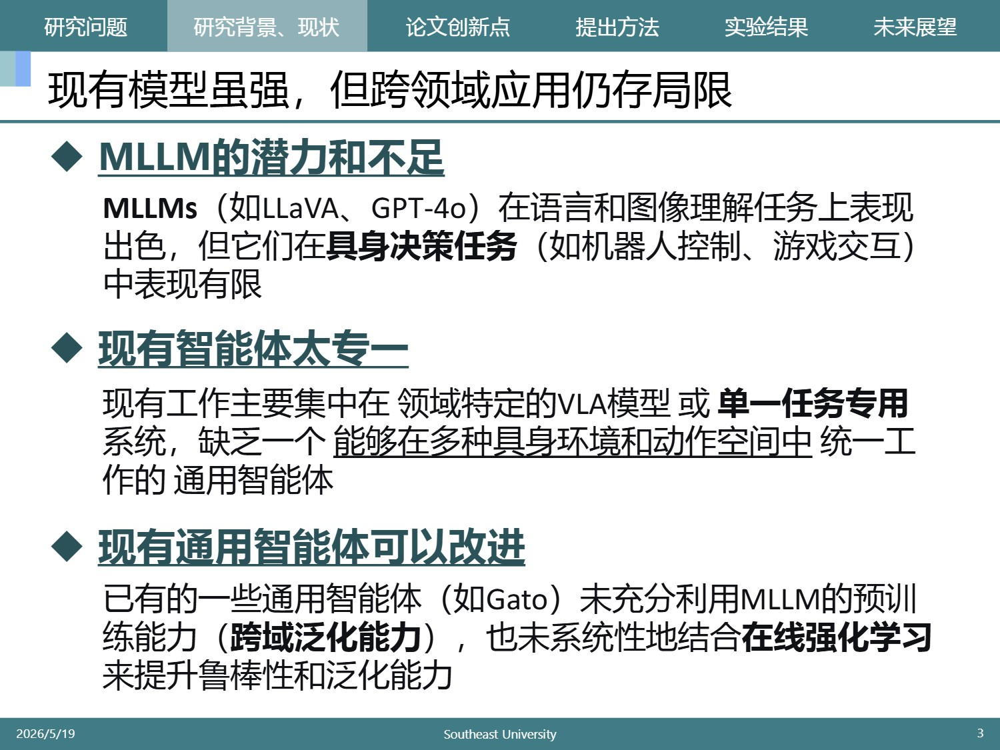

作者研究这个方向的洞察是，现有方法虽然强，但是缺少对跨领域的探索。
比如现在的MLLM很强，但是具身任务不太行。
现在的具身只是某个领域的强者，还不够通用。
或许我们可以利用MLLM的泛化性、配合多任务的迁移互助，得到更好的效果。

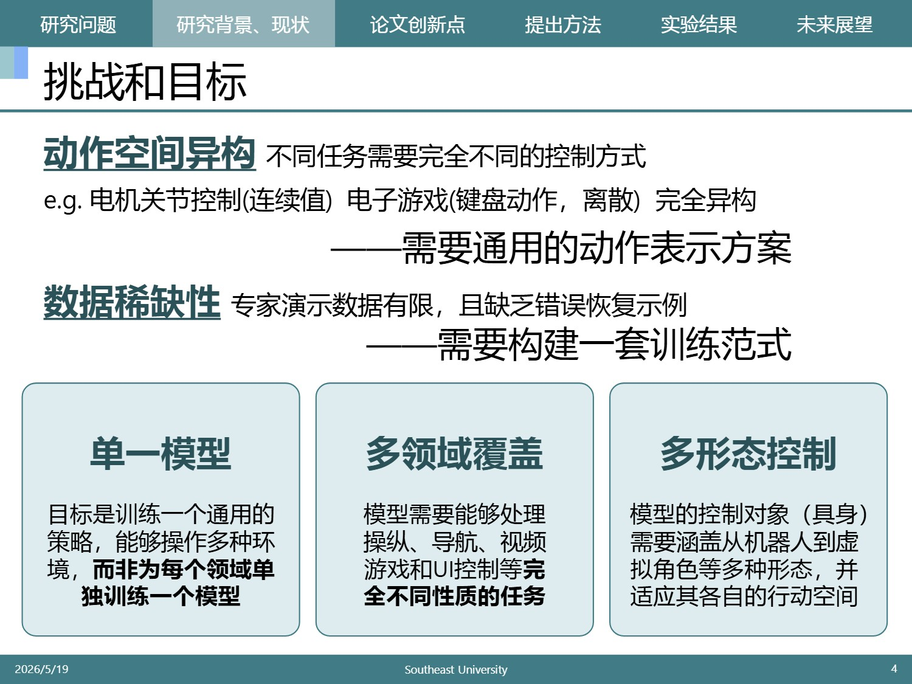

为了构建一个 多领域覆盖、多形态控制的 单一模型，我们面临两个主要的问题：
1. 如何统一不同任务的动作空间。因为不同任务中所需的动作含义不同，甚至结构都不同
2. 真实环境较为复杂，模仿学习只能覆盖冰山一角，需要在线学习。这其实是具身领域的挑战

# 论文创新点
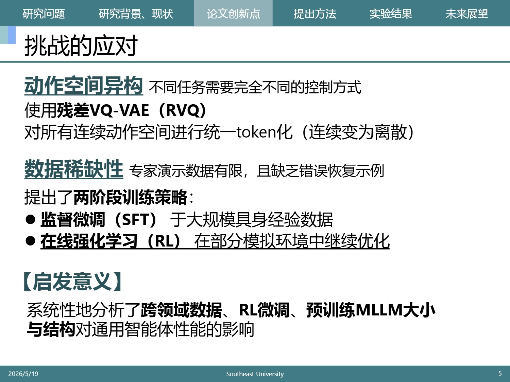

针对这两个挑战，本文有两个创新：
先使用RVQ统一了动作空间，然后设计了两阶段的训练策略。
随后这篇文章做了不少实验，得到了很多有启发价值的结论。

# 提出方法
下面就依次展开两个核心创新。

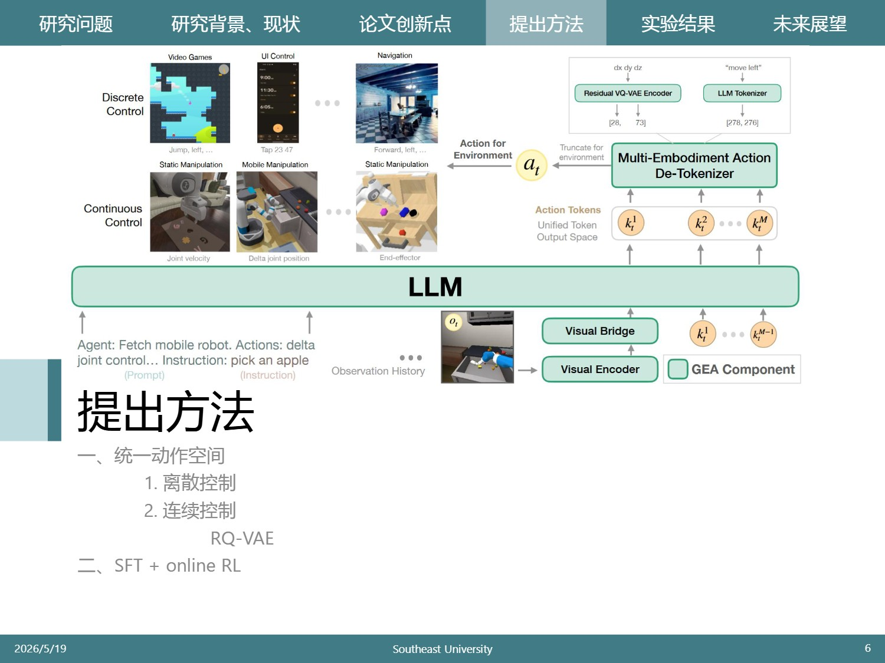

## 统一动作空间
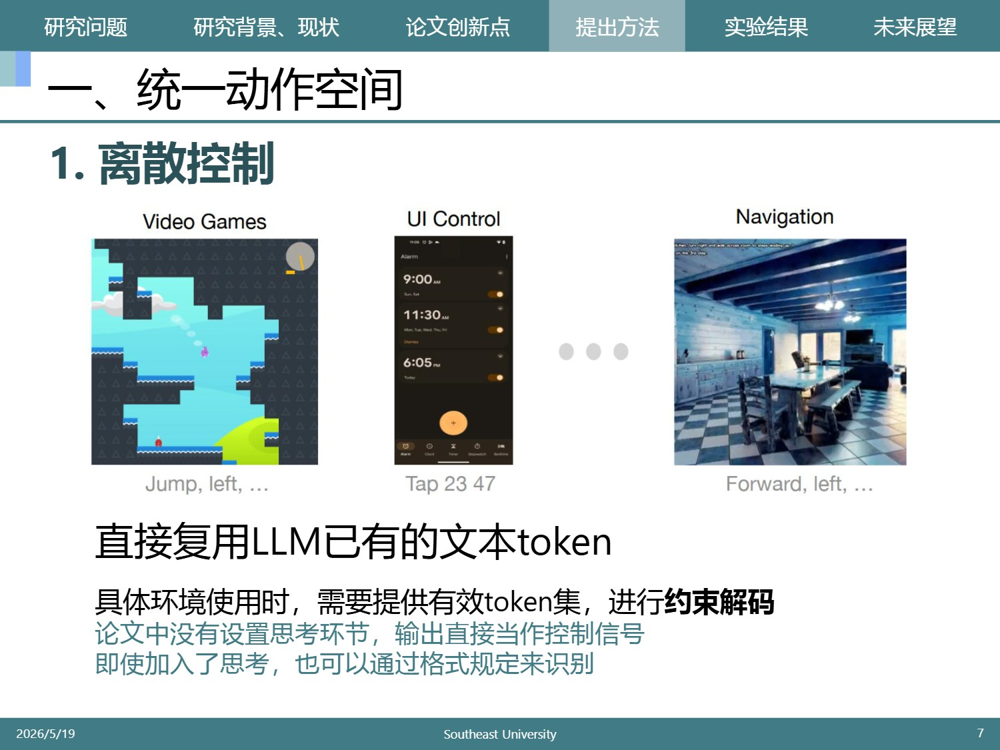

首先要统一动作空间。对于游戏控制、UI操作、导航等任务，动作是离散的，比如跳跃、点击某个位置。
不同的离散任务有不同的动作，所以作者**直接用文本表示**。
一个任务需要规定好有效的动作文本token，使用时进行约束解码，就能保证输出全是所需的。
由于实时性要求，这里没有设置显式思考环节。不过就算用了思考，也可以用特殊的token将动作输出和普通文本区分开来。

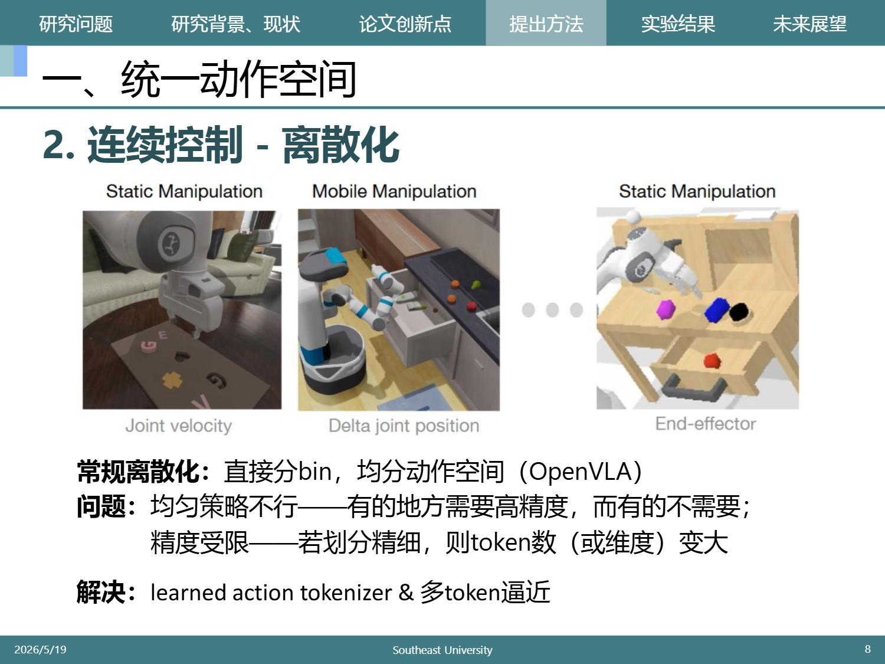

难点在于连续控制，比如电机。由于LLM的输出都是离散的token，所以常见的做法是将动作空间通过均匀划分给离散化，这是OpenVLA的策略。
这个方法注定达不到很高的精度。比如洗澡控制水温，虽然水龙头的旋转范围很大，但是关键的位置就那么几度。如果要极高精度，需要超级密集的划分，占据很多输出维度

这篇文章的解决方案是使用多个token的组合来逼近一个动作：

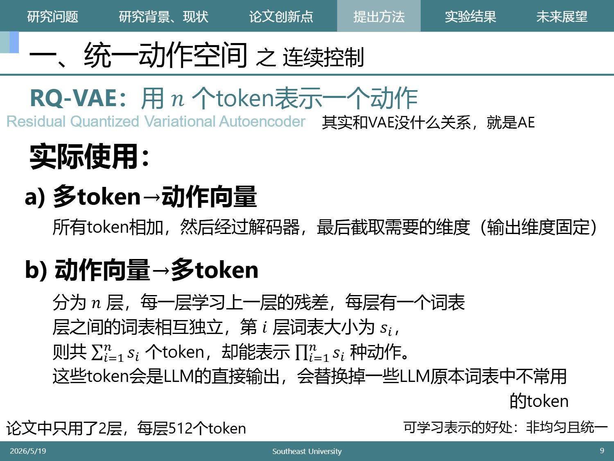

具体来说，是使用了 **RQ-VAE** 的思路，即先编码到隐状态，然后离散化为多个查询到的token。
这种可学习编码的好处是实现了非均匀统一编码。

LLM输出了多个token后，首先将这些token相加，然后经过解码器，最后截取需要的维度，就能得到该任务下的动作向量。
为了实现这个目标，模型会设置n层，每一层有单独的词表，且只学习前几层的残差。
分层的好处是表示空间是乘积变化而不是相加，可以用少量的token表示更多的动作。文中设置了两层，每层512个token。

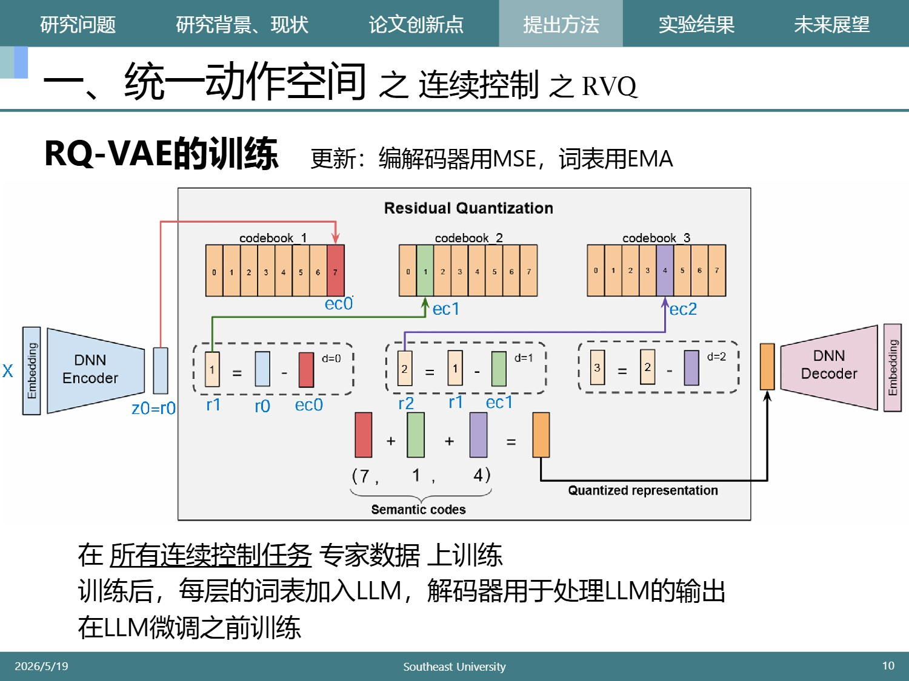

简要说一下RQ-VAE的训练。训练参数分为两部分：编解码器和词表，编解码器用重构损失进行梯度下降，而词表用指数平均更新。

RQ-VAE的训练是在微调LLM之前进行的，使用所有连续控制任务的专家数据。整个系统使用其词表和解码器。

## 训练策略
论文的第二个创新点是训练策略。这里非常像LLM的训练过程。

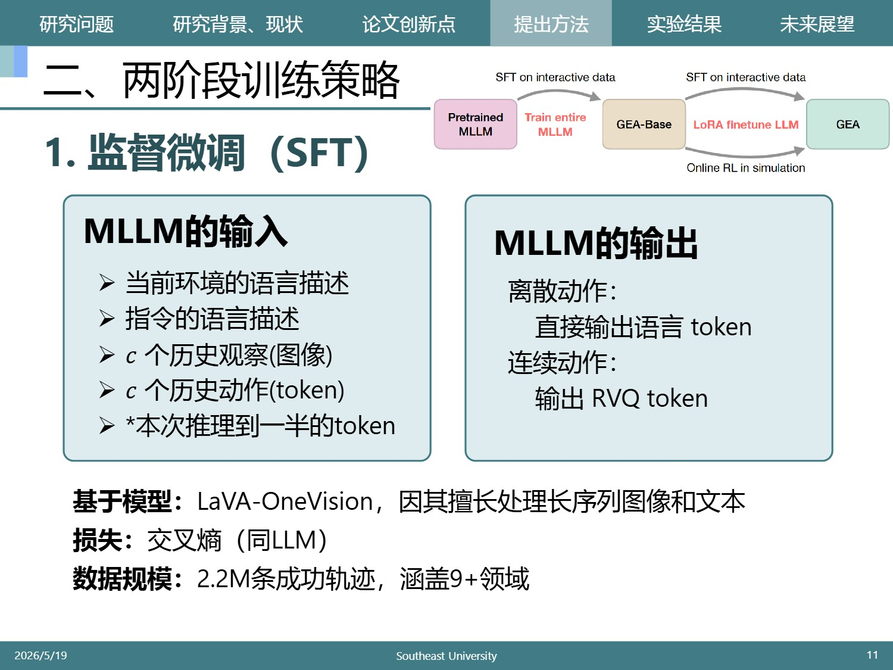

首先用专家数据进行有监督微调。MLLM接收（如图），离散任务输出文本的token，连续任务输出RVQ的token
微调的是LaVA-OneVision，因为擅长处理长序列图像和文本。其他和LLM的SFT没有什么区别。

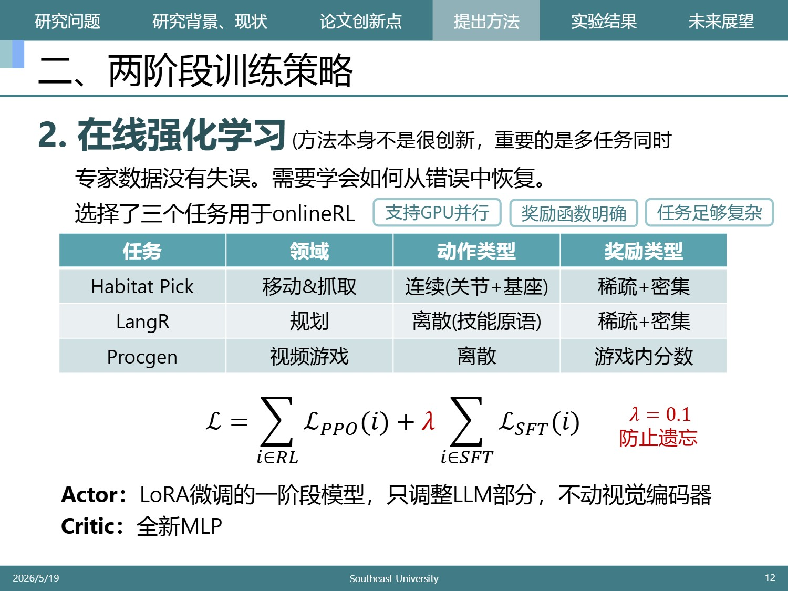

第二阶段进行在线强化学习。之所以要进行强化学习，是因为只使用专家数据时，模型不知道如何从坏状态中恢复。这个策略其实也不是很创新，不过这是**多任务同时强化学习**的。

作者在一大堆任务中选择了三个方便用的任务进行强化学习，并继续进行SFT防止遗忘。
强化学习使用的是PPO算法，Actor使用LoRA，Critic用全新的MLP训练。

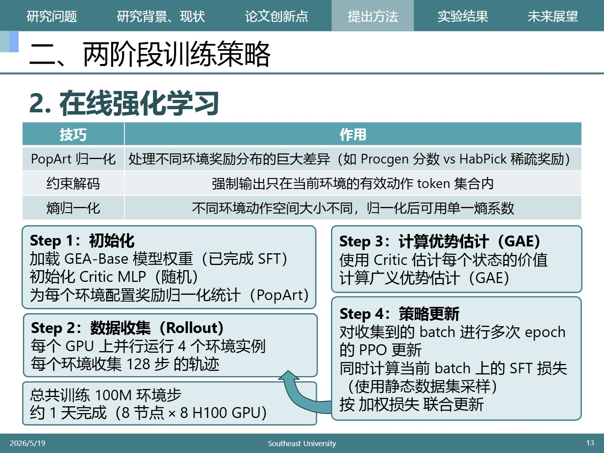

其中使用了一些多任务均衡技巧，比如用PopArt进行奖励的均衡，用熵归一化进行动作空间的均衡。整个流程还是很寻常的。这个创新点的最大意义在于其实验结论

# 实验结果
实验评估了模型在多个领域的零样本和少样本的泛化能力

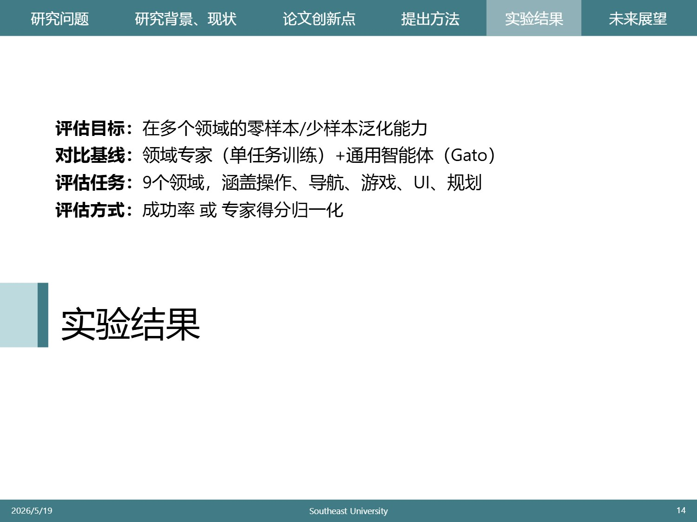

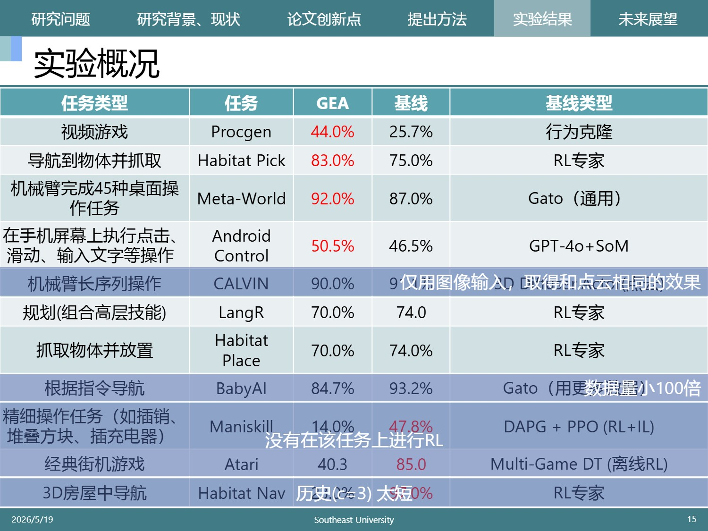

他们的方法在8/11个任务上持平或超越基线，仅在3个任务上明显落后。
但是落后的领域中有很多不公平的地方，比如基线进行了强化学习，但是GEA没有特意进行。这其实变相说明了RL的作用。
考虑到这些缺失的因素，现在的性能其实已经很不错了。

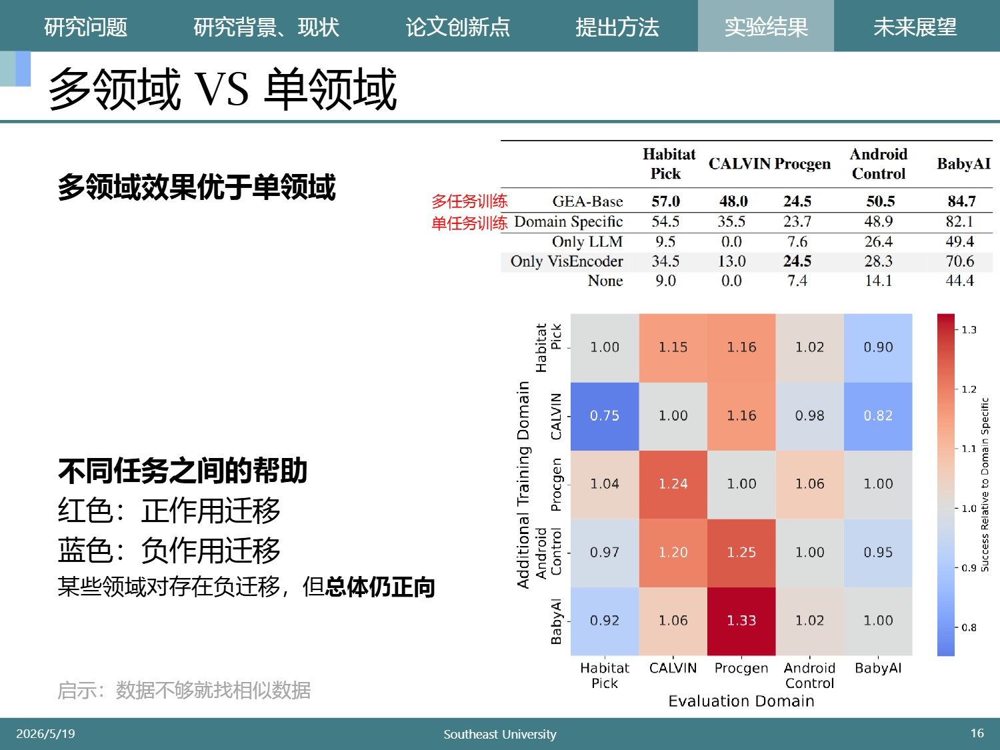

作者在SFT阶段对多任务和单任务训练进行了对比，发现多领域效果更好。
之所以“全才”能打败“专家”，作者发现不同任务之间存在正向迁移。
这张图中，红色关联的任务有正作用迁移，蓝色代表负作用迁移
虽然某些领域对存在负迁移，但总体仍正向
这说明数据不够的时候，可以挑一些相似的数据集，稍微扩大学习范围，可能反而更加容易训练出好模型

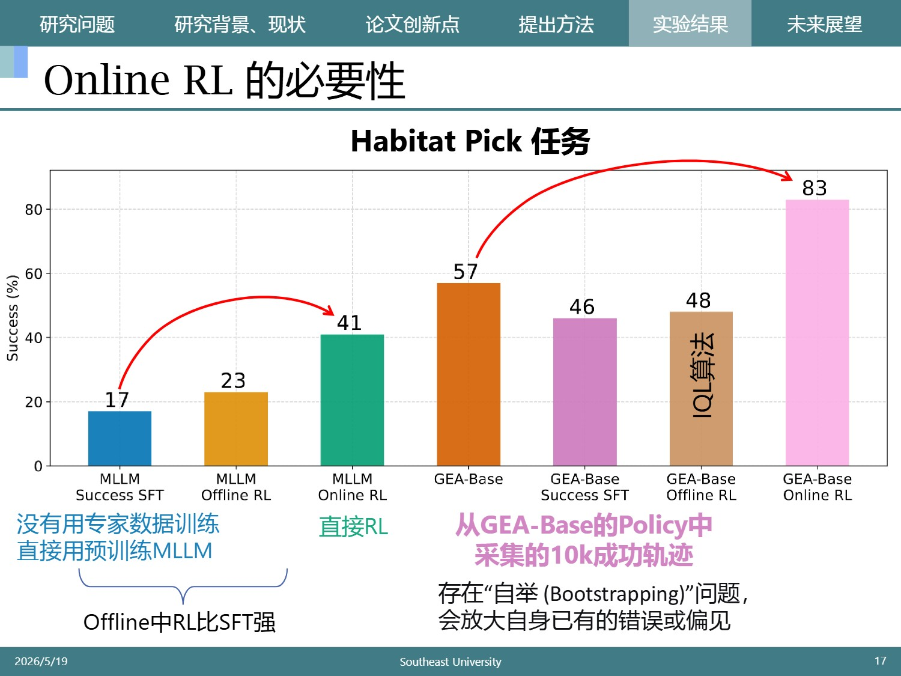

论文最大的启发意义是对在线RL进行了评估。
实验表明，在线强化学习效果特别显著，无论从零开始 online RL，还是在SFT后的模型上进行，都取得了非常显著的突破
出乎我预料的是，离线数据竟然会拉低表现。这里离线数据产生于SFT之后模型的探索，相当于自己迭代自己。
其中最差的是自己监督自己，即图中的 Success SFT。所以一定要用的话，用强化学习的形式比监督学习的更好。

还有一些别的发现，比如：
- 模型越大越好：这不是废话吗
- RL对当前任务增益较大，但泛化能力几乎没有。这解释了为什么比不过那些专门在特定领域强化学习的模型
- 视觉模型预训练的重要性远远大于LLM预训练。看来输入还是非常重要的

# 未来展望
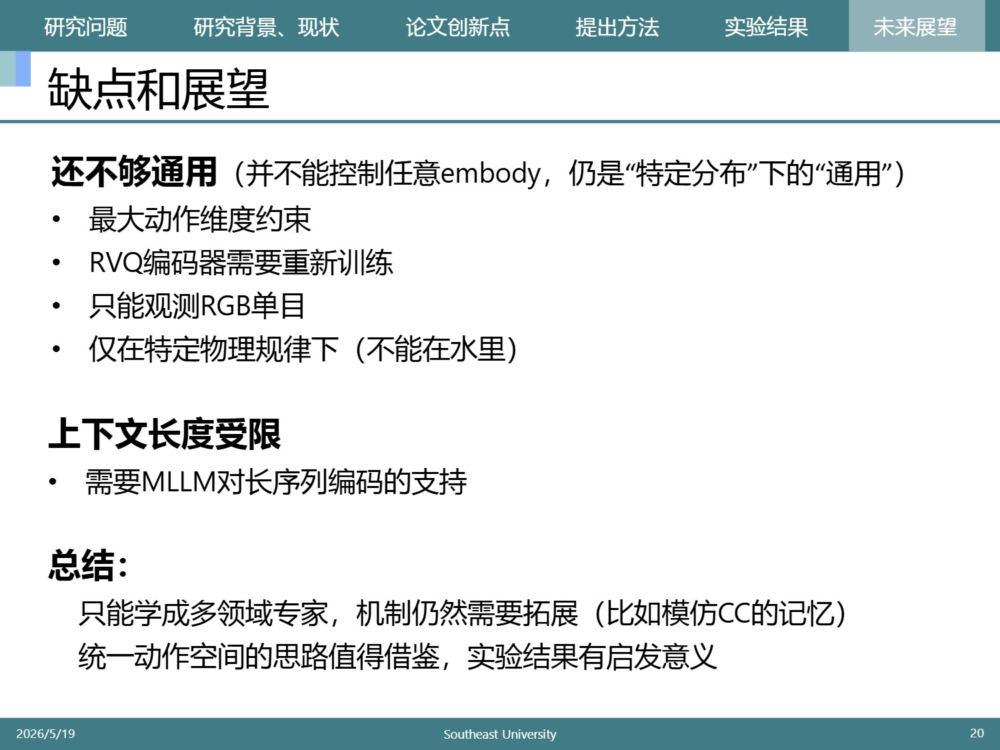

GEA是一个在特定数据分布上训练出来的专用通用智能体，而非真正意义上的“基础模型”。它的“通用”体现在能够处理多种预先定义的任务和具身体，但无法零样本泛化到训练分布之外的任意新环境和新具身体——这是这个领域的终极挑战。

在我看来，目前利用LLM的方式还是有所欠缺，或许可以学习一些编程agent的做法，比如自己总结历史、维护上下文。或者LLM的基本能力和原理就需要拓展，才能适用于更加复杂和通用的任务。

不过这篇文章统一动作空间的思路值得借鉴，实验结果也有不少启发意义。