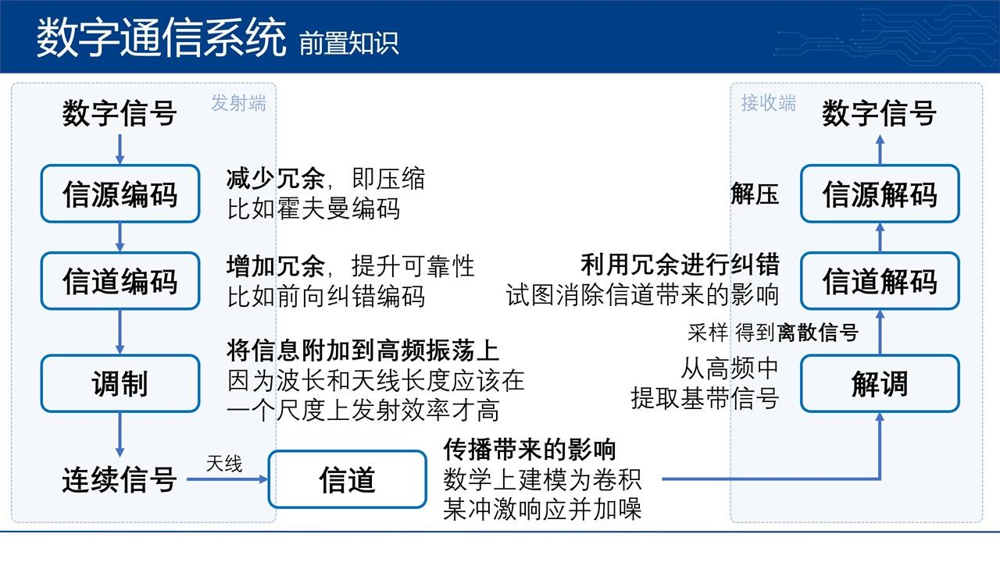
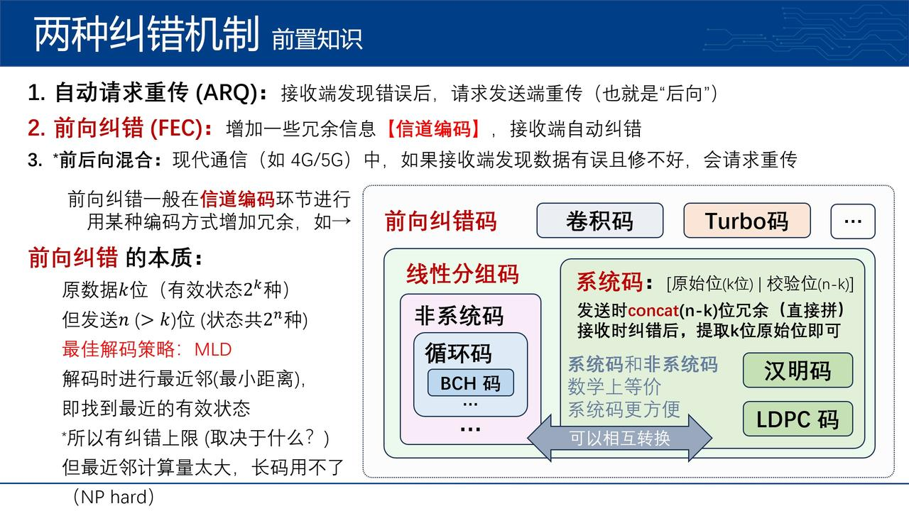
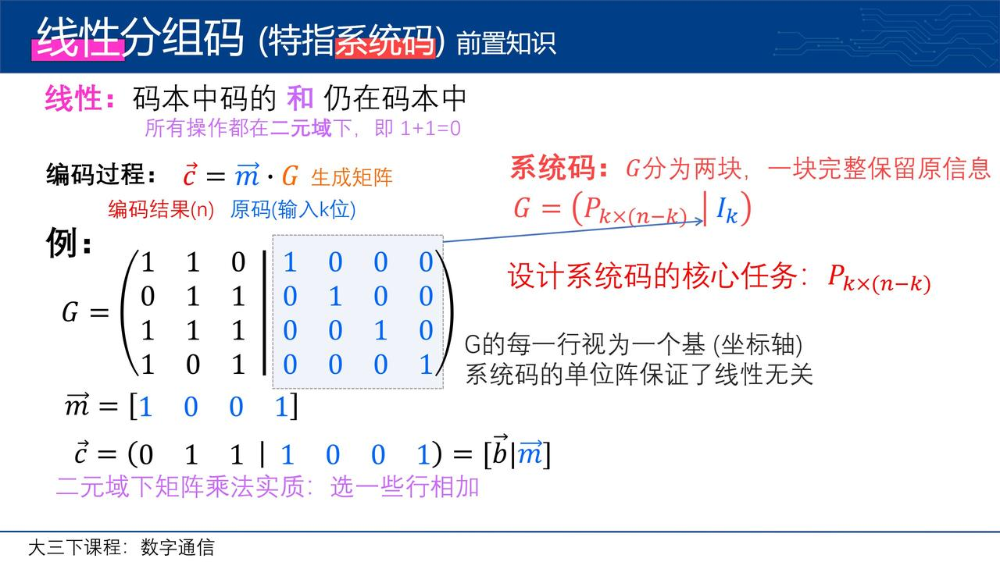
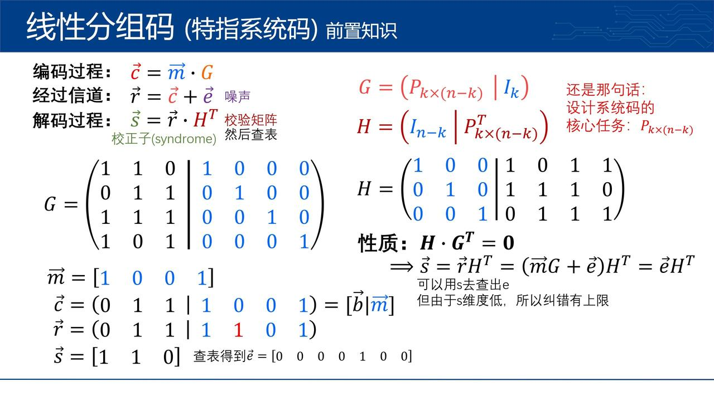
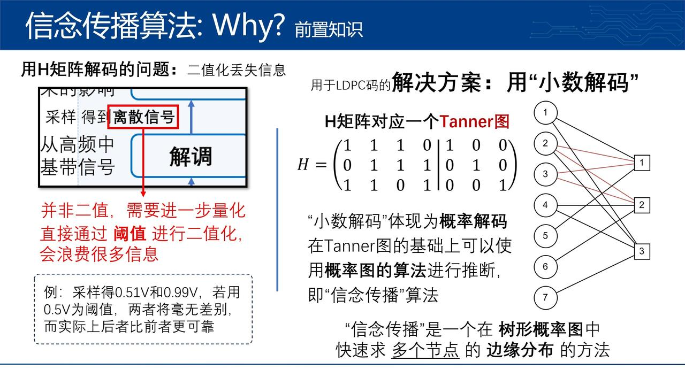
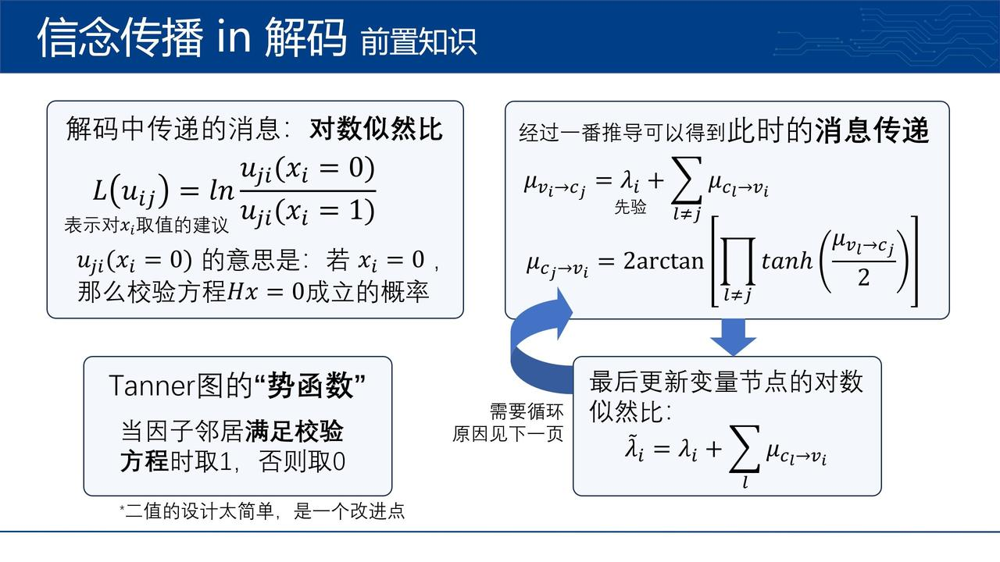
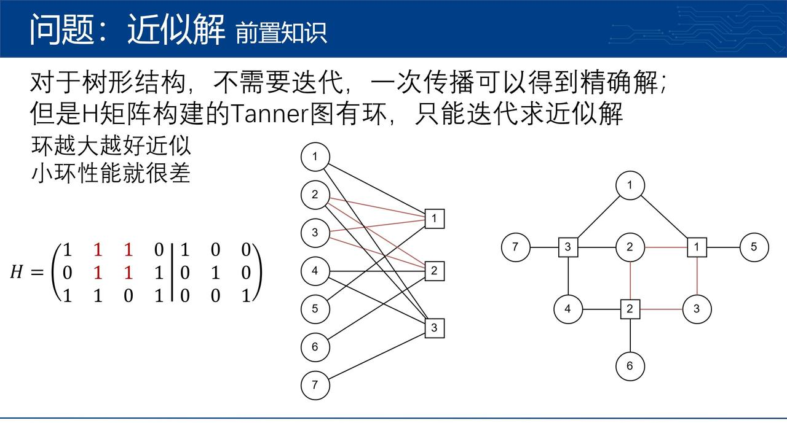
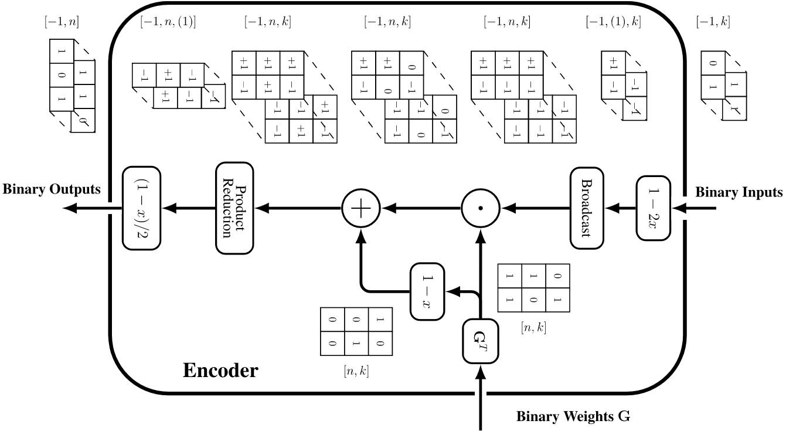
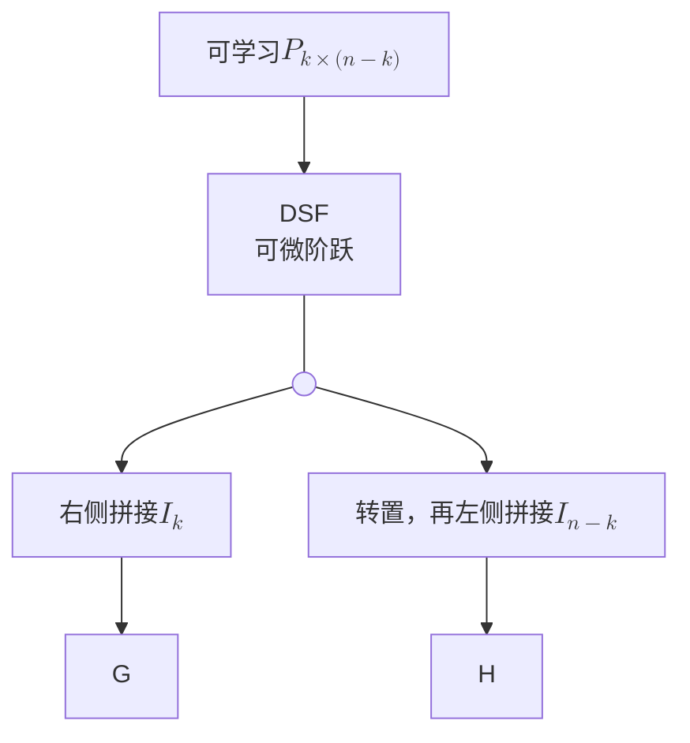
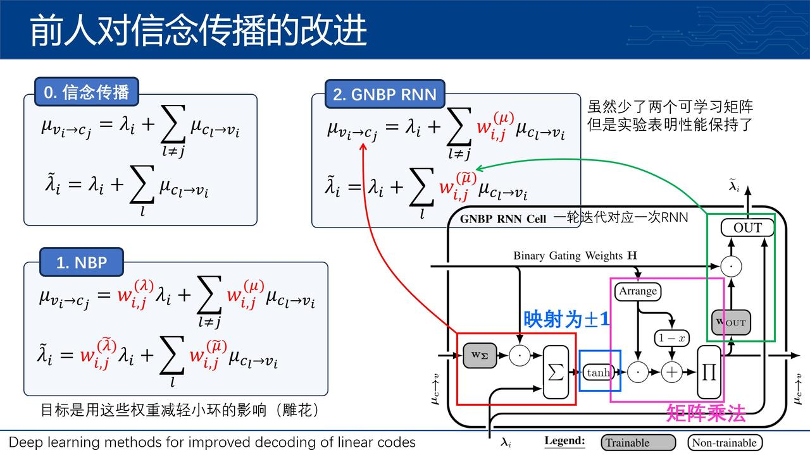

- 论文：Neural Belief Propagation Auto-Encoder for Linear Block Code Design
- 类别：用神经网络设计线性分组码、用神经网络实现编解码

# 前置知识

*关于“信念传播”的由来和推导请参看[《信念传播》](/posts/beliefPropagation) 。

# 现有问题
- 前人工作用神经网络解码，本质是“屎上雕花”（码本来就不好）
- 传统的 BP 解码器（常用于长码如 LDPC）在处理短码（如 BCH 码）时性能不佳，因为短码的 Tanner 图中存在“短环”，就算迭代也很差

因此本文端到端，又设计码，又设计解码器

- 如果使用端到端的神经网络来学习编码，参数空间会随着 $2^k$ 指数级增长，所以只能学小的码（或者需要超强泛化性）
- 神经网络是黑盒，不可解释

所以本文利用了“系统码”结构减小了学习压力（即：只学P）

目标是 中短码(相对于LDPC) & 高效解码器

# 具体方法
## 可微二元矩阵运算
二元矩阵乘法可以拆解为两个步骤：
$$
\begin{array}{l c l}
    % --- 左侧 ---
    \begin{array}{|c|c|} \hline 0 & 1 \\ \hline \end{array} \times 
    \begin{array}{|c|c|c|} \hline 1 & 1 & 0 \\ \hline 1 & 0 & 1 \\ \hline \end{array}
    &
    \Longleftrightarrow
    &
    % --- 右侧 ---
    \begin{array}{l c l}
        % 右上行
        \text{1.} \quad
        \begin{array}{|c|c|c|} \hline 0 & {\color{gray}0} & {\color{gray}0} \\ \hline 1 & {\color{gray}1} & {\color{gray}1} \\ \hline \end{array}
        \odot
        \begin{array}{|c|c|c|} \hline 1 & 1 & 0 \\ \hline 1 & 0 & 1 \\ \hline \end{array}
        \\[2em]
        % 右下行
        \text{2.} \quad
        \begin{array}{|c|c|c|} \hline 0 & 0 & 0 \\ \hline \end{array}
        +
        \begin{array}{|c|c|c|} \hline 1 & 0 & 1 \\ \hline \end{array}
    \end{array}
\end{array}
$$

首先用实数模拟二元加法运算。最基本的思路为相加结果模2，但这会导致值域不连续。如下表所示，观察到 $\pm 1$ 之间的乘法与异或结果相似度极高，因此可以将 $0$ 映射为 $+1$，将 $1$ 映射为 $-1$，进行实数乘法后，映射回去。这样的双极性映射可以用简单的线性函数拟合：$f(x)=1-2x$。

| 二元域 | 实数域 |
| :---: | :---: |
| $0 \oplus 0 = 0$ | $+1 \times +1 = +1$ |
| $0 \oplus 1 = 1$ | $+1 \times -1 = -1$ |
| $1 \oplus 1 = 0$ | $-1 \times -1 = +1$ |

二元域的乘法可以直接拓展到实数域，可以在双极性映射前完成。论文实际使用的流程如下图所示，乘法在混合域中进行，用一次实数乘法和实数加法完成，在数学上和“先相乘再映射”等价：
- 论文的做法：$f(b)\cdot G + (1-G)$
- 先二元域乘法再变换到双极性：$f(b \cdot G)$

之所以这么表示，笔者认为是因为编码矩阵一直为二元域，而信号在处理时保持双极性，这么表示避免了每次都要把信号变回“二元域”、再变回的麻烦。

## 可学习编码
首先作者利用了系统码的结构，只学习了编码矩阵和校验矩阵共用的 $P$ 部分，大大减少了学习的参数数量。

虽然上面用实数运算模拟了二元矩阵运算，但编码矩阵和校验矩阵一定都是二元的。最简单的做法就是 $P$ 保持实数双极性，但是使用前进行二值化，用一个阶跃函数就行。但阶跃函数不可微，无法反向传播。论文的做法是反向传播时使用sigmoid的导数，因为这俩长得像。作者管这个方法叫做“Differentiable Step Function(DSF)”，pytorch中封装一个算子就行。

具体流程如下：

至于维度爆炸的问题，论文选择只训练基向量。我看这样能行得通是因为系统码形式的约束。但是系统码的单位阵部分是稀疏的，会导致可学习部分更加稠密，后面实验也表明会损失理论上限。

## 神经网络实现信念传播

最终使用的是GNBP-RNN，用RNN的步数模拟了BP的迭代（是论文作者之前的工作）。每个部分和公式都一一对应。

## 实验与结论
基本流程: Encoder-BPSK-AWGN-归一化-RNN解码-交叉熵损失

超短码(8,4)码的时候最小码间距离比汉明码小，理论性能差；但是汉明码的 Tanner 图中存在很多短环，BP 解码性能很差；而 GNBP-RNN 的性能接近最大似然解码器，也比BP解码的汉明码好。这说明真的学到了适合 BP 解码的结构。

中短码实验表明主要还是编码带来的优势，和解码器关系不大。吊打了BCH+GNBP，进一步证明码的设计很重要、屎上雕花远不够。

长码的实验被LDPC吊打。这个实验其实不公平。LDPC的码一般都超级长（$10^3 \sim 10^5$ 量级），但是文中最长就选了128，属于LDPC的劣势区间，不过即使如此依然比不过LDPC。作者说LDPC迭代次数太多，不公平；那我请问RNN为什么不迭代多次呢？是不想还是不能呢？此外，LDPC的运算量其实更小，没理由选择本文的方案。