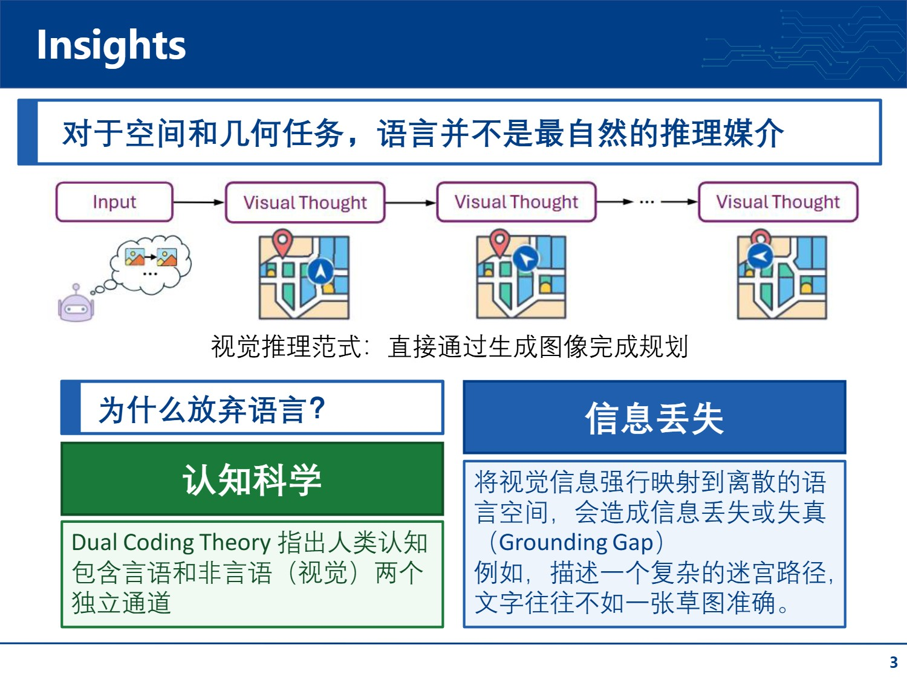
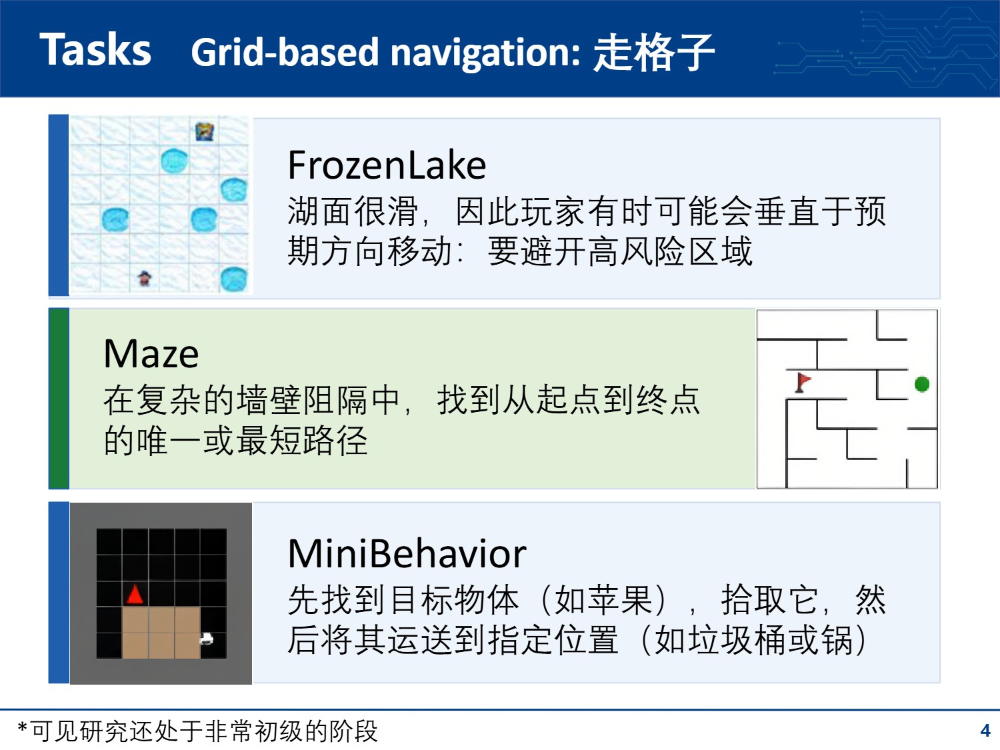
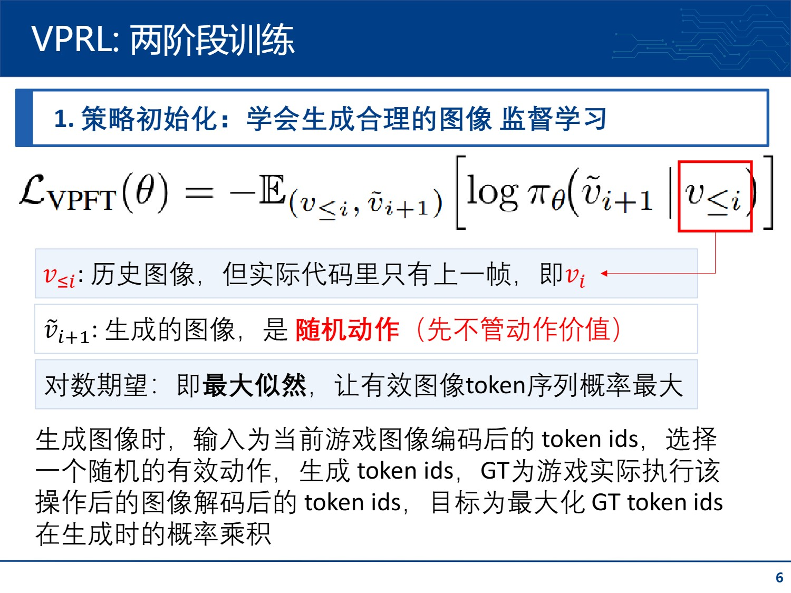
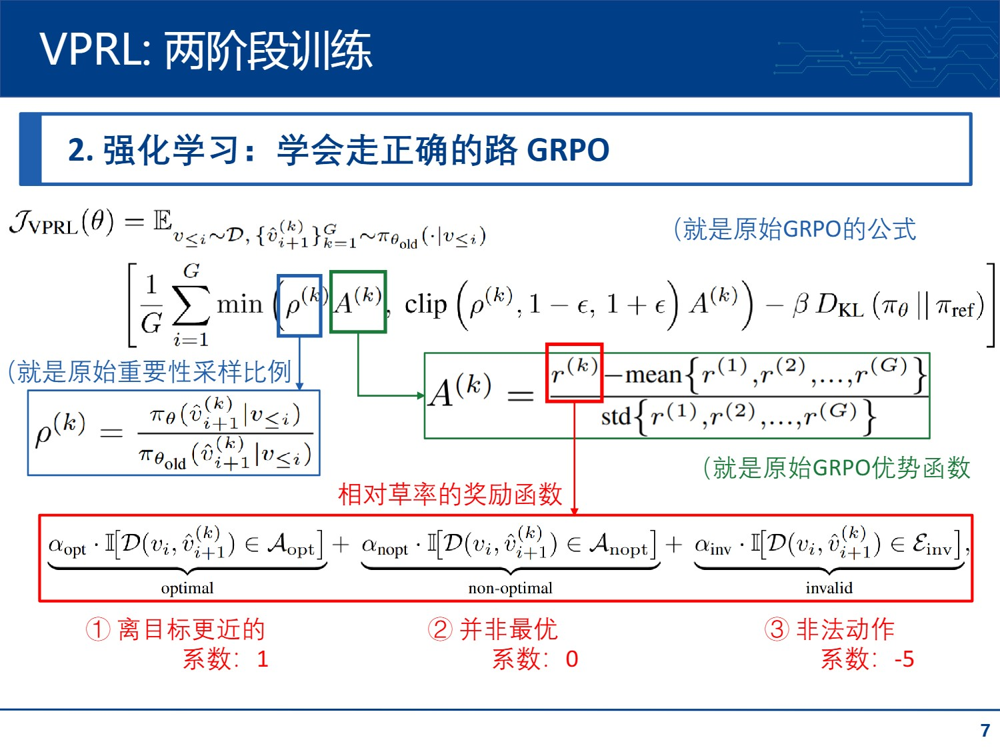
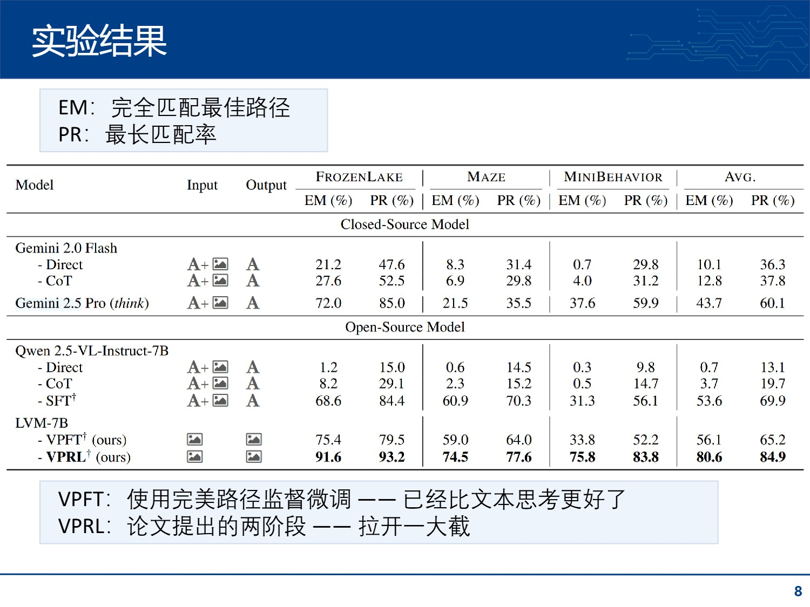
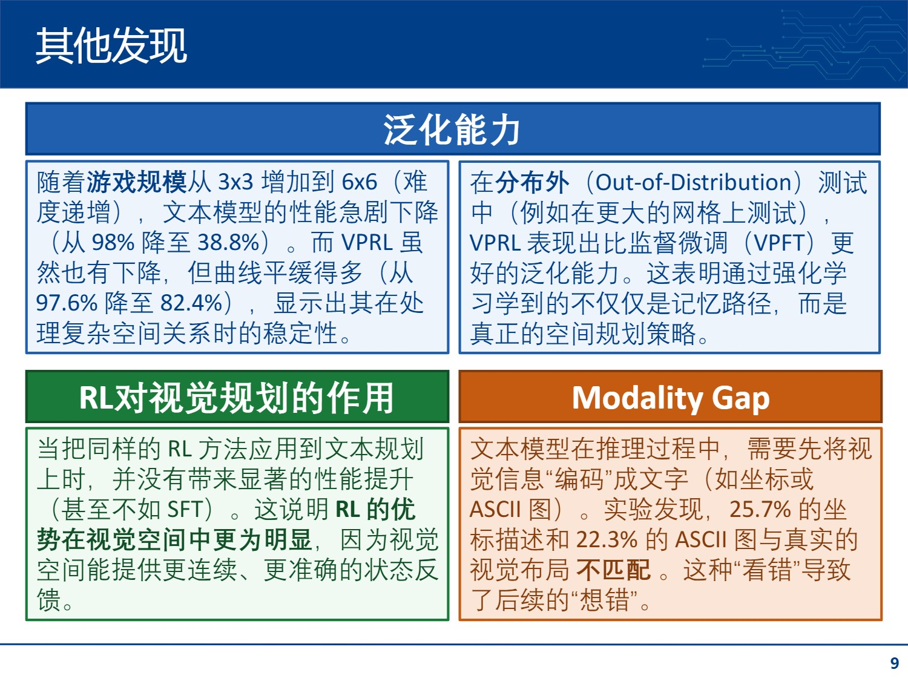

大家好，今天我要分享一篇发表在 ICLR 2026 的论文，题为《Visual Planning: Let’s Think Only with Images》，也就是用图像思考。

第一位同学分享的是将思维渲染为图片，实现思维的压缩（*Render-of-Thought: Rendering Textual Chain-of-Thought as Images for Visual Latent Reasoning*）；第二位同学讲的是文字和图像同时使用（*DEEPEYES: INCENTIVIZING “THINKING WITH IMAGES” VIA REINFORCEMENT LEARNING*）。而我要汇报的论文走向了另一个极端：完全用图像的思维链。

# 现状与动机

目前，LLM 和 MLLM 的推理主要依赖语言。即使面对视觉任务，模型也是先把图像转述成文字，再用文字进行“思维链”推理。这就像得了心盲症一样。
有一些工作使用可视化工具，为中间的思考提供图像模态，但本质仍然是基于语言的推理

作者认为，对于空间和几何任务，语言并不是最自然的推理媒介。
他们提出了Visual Planning（视觉规划）范式：让模型直接通过生成一系列图像来进行规划，中间不经过任何语言中介。
之所以放弃语言，有两个关键原因：
**人类思考可以不用语言** & **一图胜千言**

# 基本流程

他们选择了三个非常简单的任务，都是走格子类型的。这确实是视觉的优势区间，但很显然难度还是很低的，研究仍然处于非常初级的阶段。

我阅读了一下源码，计算方式总结如下：
1. 输入为当前游戏图像，首先编码为token。图像编码走的是RVQ的路线，也就是图像token是离散的、可查的。
2. 图像token经过LLM，得到新的图像token（自回归），截取后面256个（也就是新生成的256个），视为第一步思维的结果。
3. 这些token再次拼接送入LLM，得到下一轮思维结果 —— 理论上是这样，但是代码中似乎只根据上一步思维结果推理下一步，没有用多步历史。
4. 如果是推理：将每一步的图片token经过解码器，得到图像形式的每一步的思维结果；再用一个没有开源的 `ActionParser`，接收图像序列得到动作序列，这样游戏就玩完了。
6. 如果是训练：将 **思维图像token** 和 **实际游戏截图编码后的token** 进行监督学习。

# 两阶段训练
为了支持以图像生成为思维链的方式，作者设计了两阶段训练（oh，两阶段训练已经听腻了，都是先监督微调，然后强化学习）：

首先进行**策略初始化**，目标是让模型学会生成合理的图像。这一步是监督学习。

观察这个损失，非常直观：目标是最大似然，让有效图像token序列出现的概率最大。因为是RVQ，所以一个图像有多个token，要让这些token出现的概率最大。
具体的做法是：游戏里从某状态开始，随机执行一个动作，得到GT图像，GT图像编码得到 token ids。输入给模型历史游戏图像的token（实际上只有一步历史），依照GT token ids 的顺序拎出概率，最大化这些概率的对数和。

然后是强化学习，也就是真正开始思考怎么通关了。
这里用的就是原始的GRPO，和PPO的区别是：平均优势直接用蒙特卡洛方法求（也就是大量实验取均值）。没什么新奇的。
奖励函数也很无聊：离目标更近得一分，可行动作不得分，非法动作（比如试图穿墙）扣五分。

# 实验结果
看图吧，没什么好说的：

# 总结

方法很有趣，但是研究很初级。这个文章只是证明了“纯图像思维”能跑通，未来的潜力很大。

和“视觉模型”很像：都有预知未来，不过这篇文章是从初始状态一次性思考完、直接规划的，属于开环预演。可能更有效的方式是：先预测未来一段时间，然后执行一步，再在当前状态下继续预测。这是环境的反馈。

这个图像思维链也没有总结。LLM思考完会给出最终结果，这里缺少这个最终结果。也就是这里是“思考即行动”，而应该是“思考再行动”。这篇论文的流程实现不了这个效果。

而和人类的图像思维比起来，这篇文章的思维还是太离散了（当然这篇文章的任务用不上）。人是怎么思考的？至少可以“模拟”出一个动画效果。不知道追求人的思维是否正确。

连续思考可能面临计算量的问题。最近看到一个视频，说人脑能将“亿”级的输入信息压缩为10bit。或许能有所启发。