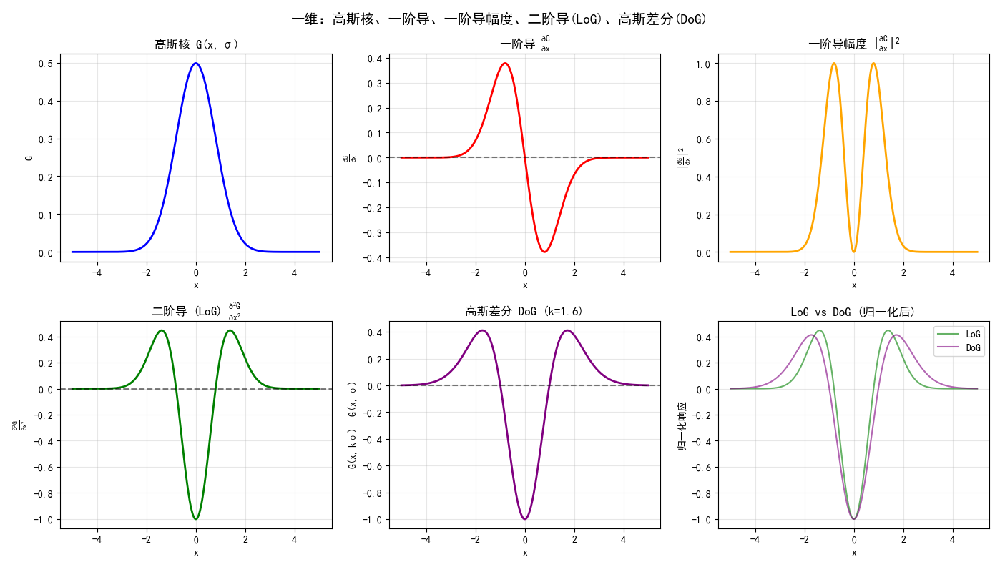
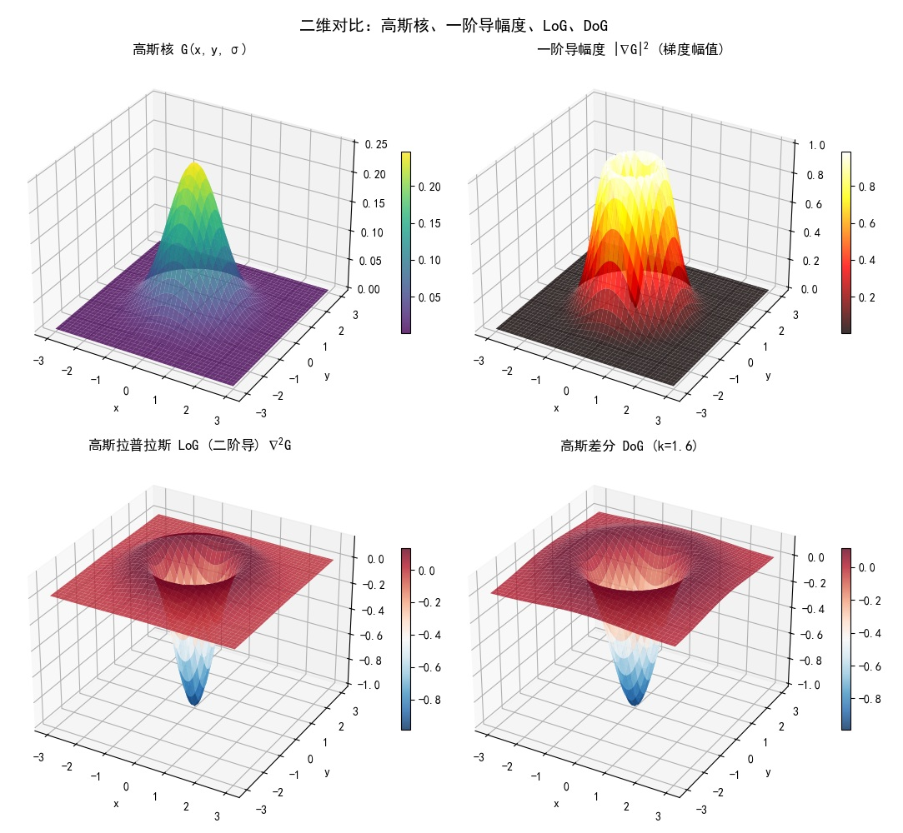

# 形态学
## 形态学运算定义
二值形态学与灰度形态学 扩张(Dialtions)、侵蚀(Erosions)、开运算(Opening)、闭运算(Closing) 的定义

### 二值形态学
**Structing Elements (SE)** 结构元，也就是卷积核非0部分的形状。后面记为 $B \in Z^2$，是二维坐标（向量）的集合。

**二值·侵蚀(Erosions)**: $ A \ominus B = \{ p \mid (B)_p \subseteq A \} $
表现为白色缩了一圈、黑色扩了一圈。
其中 $(B)_p = \{b + p | b \in B\}$，整个式子的意思是：$B$ 平移后在 $A$ 中的点构成的图，叫做 $B$ 侵蚀 $A$ 的结果。

**二值·扩张(Dialtions)**: $ A \oplus B = \{ p \mid (\hat{B})_p \cap A \neq \emptyset \} $
表现为黑色缩了一圈、白色扩了一圈。
其中 $\hat{B} = \{(-x,-y) | (x, y) \in B\}$，也就是移回去在 $A$ 内的点的集合。
更简单的写法：$ A \oplus B = \bigcup_{p \in A} (B)_p $

对原图的操作 $\Leftrightarrow$ 对补图的另一个操作的补（对偶）：
$$
\begin{aligned}
    \left( A \ominus B \right)^c &= A^c \oplus \hat{B}\\
    \left( A \oplus B \right)^c &= A^c \ominus \hat{B}
\end{aligned}
$$
用上面的定义可以很简单地证明。

**开运算(Opening)**: $ A \circ B = (A \ominus B) \oplus B $ —— 先小后大
**闭运算(Closing)**: $ A \bullet B = (A \oplus B) \ominus B $ —— 先大后小

**性质：**
1. 幂等——做1w次=做1次
2. 不改变包含关系
3. 大小关系: $ A \bullet B \subseteq A \subseteq A \circ B $
4. 对偶

### 灰度形态学
灰度时取补就是相反数（二值时取非）。

如果不是为了考试，其实记灰度的就够了。这个更统一更好背。推广到二值就是把 max 变成了 OR，把 min 变成了 AND。

**flat SE**: SE是二值的MASK，“平的”
- 侵蚀: $\left[ f \ominus b \right](x, y) = \min_{(s,t) \in b} \left\{ f(x + s, y + t) \right\}$
- 扩张: $ \left[ f \oplus b \right](x, y) = \max_{(s,t) \in b} \left\{ f(x - s, y - t) \right\} $

**nonflat SE**: 有相对大小变化的SE
- 侵蚀: $ \left[ f \ominus b_N \right](x, y) = \min_{(s,t) \in b_N} \left\{ f(x + s, y + t) - b_N(s, t) \right\} $
- 扩张: $ \left[ f \oplus b_N \right](x, y) = \max_{(s,t) \in b_N} \left\{ f(x - s, y - t) + b_N(s, t) \right\} $

开闭运算定义不变，不过此时集合倒是不存在了——所以只有**幂等**和**对偶**性。

## 形态学的应用
### 二值形态学重建
目标：二值图 $G$ 有多个不连通的部分，给你一个部分的种子，要把包含这个种子的部分提取出来。

本质上就是从这个种子开始 广度优先 遍历图内像素，不过这里用 扩张运算 实现了广度优先。评价为计算开销更大，垃完了。

记种子图为 $I_0$，具体做法：
$$
I_k = (I_{k-1} \oplus B) \cap G
$$
也就是先扩张，然后把区域外的切掉，循环直到收敛。显然部分之间的最小间距不能比SE半径窄（还有限制，真不如广度优先一根）。

但是把 $\cap$ 看作 $\land$，进而变为“min”，就能得到灰度形态学重建：

### 灰度形态学重建 H-dome
此时形态学的优势才体现出来。种子图 $I_0 = G - c$，显然 $I_0$ 就是原图暗了一些。
$$
\begin{aligned}
I_k &= \min(I_{k-1} \oplus B, G) \\
G' &= G-I_{\infin}
\end{aligned}
$$
迭代过程中像素值和原值的差异在 $c$ 以内，而深色部分和原值的差异比浅色部分更小，因为扩张是求max，是局部最亮拉动局部最暗，但局部最亮没有像素拉，导致其与原始的差值始终为 $c$。

这个“局部”是用min实现的，如果没有min，经过无数次迭代，整张图就成局部了。min制造了沟壑，防止了蔓延。

由此可见：$c$ 是重建后的最大灰度，也是对“局部范围内，前景和背景灰度差”的估计。

### Convex Hull 找凸包
二值形态学中的。基本原理：
$$
\begin{aligned}
    I_{i,k} &= (I_{i,k-1} \ominus B_i) \cup I_{i,k-1} \\
    I_{ch} &= \bigcup_{i=1,2,3\dots} I_{i, K}
\end{aligned}
$$
其中 $B_i$ 的设计很有意思：如果要生成的边为45°的方形，那么一共设置4个 $B$，生成左边那个尖角的SE长这样：
```txt
0 0 1
0 0 1
0 0 1
```
为什么生成的的是90°？因为“1”和中心点的连线覆盖了90°。所以如果是下面的形态元：
```txt
0 0 0 0 1
0 0 0 0 1
0 0 0 0 1
```
生成结果左边的尖角会是 $2\arctan(0.5)$。显然取最终并集的时候得到的不是凸包——会有四个向内凹陷的钝角。

为什么是“并”？很显然——侵蚀会减小面积；
为什么是 “侵蚀”？需要思考一下：仅有当结构元处都是1，才能将“与中心连线”的那个三角填上颜色。如果是 “扩张”，那就变成广度优先遍历了。

### 顶帽变换 Top-Hat Transform
本质上是提取高频（比结构元小的东西）。之所以叫“顶帽”，指的就是得到的是小突起（整张图像是广场，最高的是帽子）。

对灰度图，作业里用这个方法求不均匀光照下的二值化：先用这个变换消除背景的不均匀，再全局阈值。

记原图为 $f$，形态元为 $b$，结果为 $h$，背景暗而目标亮使用:
$$
h = f - (f \circ b)
$$
灰度的开运算结果一定比原值小，相当于提取了背景。形象化的理解是：开运算把亮的部分消除了，并用临近值填充了原来亮的位置。

如果背景暗而目标亮，就反过来：
$$
h = (f \bullet b) - f
$$

要求形态元比要保留的大。作业里是松散的米粒，何尝不是一种 cherry pick。

### 边缘提取
以提取浅色区域为例：
$$
h = f - (f \ominus b)
$$
非常显然，相当于白色先缩小一点，让出边界的位置。

# 模糊方法
## 模糊集合论基本定义
元素 $z$ 属于模糊集 $A$ 的程度——隶属度
$$
\mu_A(z) \in [0,1]
$$

定义集合需要用 *(元素,隶属度)* 的二元组的集合:
$$
A = \{ (z, \mu_A(z)) | z \in Z\}
$$
对，全集 $Z$ 的每一个元素都在A里，只不过是隶属度的高低罢了。

**模糊集的运算**：对 $\forall z \in Z$:
- 空: $\mu_A(z) = 0$
- 集合相等: $\mu_A(z) = \mu_B(z)$
- **子集**: $\mu_A(z) \leq \mu_B(z)$
- 补(NOT): $\mu_{\bar{A}}(z) = 1 - \mu_A(z)$
- 并(OR): $\mu_{A \cup B}(z) = \max(\mu_A(z), \mu_B(z))$
- 交(AND): $\mu_{A \cap B}(z) = \min(\mu_A(z), \mu_B(z))$

## 模糊推断系统基本概念
- **模糊化**(Fuzzification)：将 crisp 输入转换为模糊语言变量（使用隶属函数）
- **知识库**(Knowledge Base)：包含隶属函数和模糊规则
- **推理机制**(Inference)：应用 if-then 规则将模糊输入映射为模糊输出
- **去模糊化**(Defuzzification)：将模糊输出转换为 crisp 输出

### 规则
专家知识就是规则，表现为一系列“if-then”:
- 规则**内部**的条件使用 AND 连接多个前提。then 的处理分为两大方法，见下
- 规则**之间**使用 OR 连接

> 例子：图像增强
> Expert knowledge (linguistic rule)
> - If a pixel is dark, then make it darker
> - If a pixel is gray, then keep it gray
> - If a pixel is bright, then make it brighter
>
> 记输入为 $i_1$，输出为 $i_2$，有：
> Expert knowledge (reiterated)
> 1. $i_1$  is “dark” **and** $i_2$  is “darker” 
> 2. $i_1$  is “gray” and $i_2$  is “gray” 
> 3. $i_1$  is “bright” and $i_2$  is “brighter”

这里为什么“蕴含”也用了AND？这是 Mamdani 模型，类似联合概率；而“以条件隶属度为权值对then进行加权”是 Takagi-Sugeno 模型。

课上只讲了 Mamdani 模型。举个例子：
1. 如果输入满足条件1 => 输出满足要求1
2. 如果输入满足条件2 => 输出满足要求2
3. 否则 输出满足要求3

- 规则1隶属度(输出)=min( 条件1(输入), 要求1(输出) )
- 规则2隶属度(输出) = min( 条件2(输入), 要求2(输出) )
- 规则3隶属度(输出) = min( 条件3(输入), 要求3(输出) )

> 每个隶属度的具体计算需要定义，也就是“知识库”
> 这里没有考虑 if-else 的关系：规则之间平行

$$
\begin{aligned}
&\text{总隶属度}(\text{输出})=\max(\\
&\quad\quad\text{规则1隶属度}(\text{输出}),\\
&\quad\quad\text{规则2隶属度}(\text{输出}),\\
&\quad\quad\text{规则3隶属度}(\text{输出})\\
&)
\end{aligned}
$$

“总隶属度”是变量“输出”的函数，下一步就是遍历所有可能的输出值，计算每个输出值的总隶属度，最后用某种去模糊方法（见下）得到最终结果。

### 去模糊化方法
- **重心法(centroid of gravity)**: 对上面的例子来说，就是用每个“输出”的隶属度作为权重，对“输出”计算加权平均。
- **Bisector of area**：找到一个输出值，使得这个输出值的总隶属度曲线下面积被分成两半。
- **Mean of maximum**：找到总隶属度曲线的最大值，求出所有输出值对应的总隶属度等于这个最大值的输出值的平均。
- **Smallest of maximum**：找到总隶属度曲线的最大值，求出所有输出值对应的总隶属度等于这个最大值的输出值中的最小。
- **Largest of maximum**：找到总隶属度曲线的最大值，求出所有输出值对应的总隶属度等于这个最大值的输出值中的最大。

## 大津法、模糊分割方法优化的目标函数
### 大津法OTSU
理想情况是图像有两个峰，最佳阈值在两个峰之间的谷底。大津法的目标是找到一个分界点，左侧的方差和右侧的方差的加权平均最小（刚好分离两个峰），这就是最小化类内方差。根据“总方差=类间方差+类内方差”，可知等效于最大化类间方差。

总方差：$\sigma^2 = \frac{1}{N} \sum_{i=1}^N (x_i - \mu)^2$
||
类内方差：$\frac{n_0}{N} \sigma_0^2 + \frac{n_1}{N} \sigma_1^2$
+
类间方差：$\frac{n_0}{N} (\mu_0 - \mu)^2 + \frac{n_1}{N} (\mu_1 - \mu)^2 = \frac{n_0}{N} \frac{n_1}{N} (\mu_0 - \mu_1)^2$

OTSU没有解析解，要遍历所有可能的阈值，计算每个阈值对应的类内方差或类间方差，找到最优的那个。

### 模糊分割方法
假设阈值为 $t$，小于 $t$ 的像素的均值为 $\mu_0$，大于等于 $t$ 的像素的均值为 $\mu_1$。对于像素值 $X$，在给定 $t$ 时，其属于当前划分的隶属度由下式给出：

$$
\mu_X\left(X\right)=\left\{\begin{matrix}\frac{1}{1+\frac{\left|X-\mu_0\right|}{C}},\ X<t\\\frac{1}{1+\frac{\left|X-\mu_1\right|}{C}},\ X\geq t\\\end{matrix}\right.
$$

其中 $C=256$。目标函数有多种，作业里是最小化熵：
$$
\argmin_t \sum_{m,n} H(\mu_X(X_{m,n}))
$$
这里熵是把隶属度看作概率，用二分类的熵：
$$
H(p) = -p \log p - (1-p) \log (1-p)
$$
要最小化熵，就要让p接近0或1，考虑到给出的隶属度公式，也就是让其和 当前类别的均值 尽可能接近，也就是最小化类间方差了。实际实验中，模糊分割对不均匀亮度的适应性，比OTSU更好（作业用的是四个灰度不一的物品，在黑色背景上）。

## 模糊聚类方法基本概念
- 硬聚类：每个数据点只能属于一个簇
- 模糊聚类：每个数据点可以属于多个簇

统一的目标函数:
$$
\min J = \sum_{i=1}^N \sum_{j=1}^K r_{ij} \| x_i - c_j \|^2
$$
其中：
- $N$ 是数据点的数量
- $K$ 是簇的数量
- $x_i$ 是第 $i$ 个数据点
- $c_j$ 是第 $j$ 个簇的中心
- $r_{ij}$ 是数据点 $x_i$ 属于簇 $j$ 的隶属度。

更新簇中心的公式：
$$
c_j = \frac{\sum_{i=1}^N r_{ij} x_i}{\sum_{i=1}^N r_{ij}}
$$

对于 Kmeans，$r_{ij}$ 是一个二值变量，表示数据点 $x_i$ 是否属于簇 $j$。对于模糊聚类，$r_{ij}$ 是一个连续变量，表示数据点 $x_i$ 属于簇 $j$ 的程度。

# 统计方法
- 伯努利统计：就是二项分布，抛硬币，组合数
- 贝叶斯统计基本概念

简要说说作业吧。

### 1. 最小二乘复原
有向量 $x$，经过 变换矩阵 $A$ 变成 $y$，有噪声 $n$（高斯噪声，每个维度的方差不一样），所以 $y = Ax + n$。已知 $A$ 和 $y$，求 $x$ 的估计 $\hat{x}$。方法是最小二乘：
$$
\hat{x} = \argmin_z \| y - Az \|^2
$$
求个导，顺别复习一下矩阵求导（也可以展开逐项套公式）：
$$
\begin{aligned}
d\| y - Az \|^2 &= d\left( (y - Az)^T (y - Az) \right) \\
&= (-Adz)^T (y - Az) - (y - Az)^T A dz \\
&= 2 (Az - y)^T A dz \quad\quad\text{都是标量，直接转置直接加} \\
&= \left\{ [2A^T (Az - y)]^T dz\right\}^T \quad\text{整理成} df=[(\frac{df}{dz})^T dz]^T \\
\frac{d\| y - Az \|^2}{dz} &= 2 A^T (Az - y) := 0 \\
A^T A z &= A^T y \\
z &= (A^T A)^{-1} A^T y
\end{aligned}
$$
重建后均方误差为 10，可见效果并不行，这是因为每个维度一视同仁。

### 2. 统计理论下的最小二乘
也就是用贝叶斯方法讲述了如何加权。
$$
\begin{aligned}
\hat{x} &= \argmax_{\vec{x}} P\left(\vec{x}|\vec{y}\right)=\frac{P\left(\vec{y}|\vec{x}\right)P(\vec{x})}{P\left(\vec{y}\right)} \\
&= \argmax_{\vec{x}} P\left(\vec{y}|\vec{x}\right) \quad\text{(无先验概率时)}\\
&= \argmax_{{\vec{x}}} \prod_{i}\exp{\left(-\frac{\left(y_i-{\vec{a}}_i^T\vec{x}\right)^2\ }{2\sigma_i^2}\right)} \\
&= \argmin_{{\vec{x}}} \sum_i \frac{1}{\sigma_i^2} \left(y_i-{\vec{a}}_i^T\vec{x}\right)^2 \quad\text{取了对数}\\
&= \argmin_{{\vec{x}}} \sum_i \left(\frac{y_i}{\sigma_i}-\frac{{\vec{a}}_i^T}{\sigma_i}\vec{x}\right)^2 \\
\end{aligned}
$$
最后一步相当于求解：
$$
(\Sigma \cdot A) \cdot \vec{x} = \Sigma \cdot \vec{y}
$$
的最小二乘解，其中
$$
\Sigma = \begin{pmatrix}
1/\sigma_1 & 0 & ... & 0 \\
0 & 1/\sigma_2 & ... & 0 \\
\vdots & \vdots & \ddots & \vdots \\
0 & 0 & ... & 1/\sigma_n \\
\end{pmatrix}
$$
实现了对每个维度的加权，方差越大（越模糊），重要性越小，防止影响到其他更确定的维度。说实话这和我想当然的结果恰好相反，蛮有趣的。重建后均方误差为 0.03，效果非常好。

### 3. 图像复原
- 模糊图像 $I_{blur}$：将原图拉成一个高维向量，乘上一个很大的矩阵 $A$，然后加上了标准差为 $\sigma_{blur} = 0.01$ 的高斯噪声。
- 噪声图像 $I_{noisy}$：将原图加上标准差为 $\sigma_{noisy} = 20$ 的高斯噪声

要在输入为 这两个图像、已知 $A$ 和 $\sigma_{blur}$ 和 $\sigma_{noisy}$ 的情况下，复原出原图。

最简单的做法是直接对 $I_{blur}$ 用**最小二乘**，但是数值爆炸了。需要加入正则项才能重建（惩罚过大的结果），虽然效果很不错，但是要调参。

另一种方法是建立概率模型：
$$
\begin{aligned}
\hat{I} &= \argmax_{\vec{I}} P(\vec{I} | \vec{I}_{blur}, \vec{I}_{noisy}) = P(\vec{I}_{blur} | \vec{I}) P(\vec{I}_{noisy} | \vec{I}) P(\vec{I}) / P(\vec{I}_{blur}, \vec{I}_{noisy}) \\
&= \argmax_{\vec{I}} P(\vec{I}_{blur} | \vec{I}) P(\vec{I}_{noisy} | \vec{I}) \quad\text{(没有先验)}\\
&= \argmax_{\vec{I}} \exp\left(-\frac{(I_{blur} - A\vec{I})^2}{2\sigma_{blur}^2}\right) \exp\left(-\frac{(I_{noisy} - \vec{I})^2}{2\sigma_{noisy}^2}\right) \\
\end{aligned}
$$
可以求得理论解，均方误差比精调的正则化差一些。

## 基本的优化方法
- 模拟退火：如果随机偏移后更优就接受，否则以概率 $\exp\{-\frac{\Delta E}{T}\}$ 接受，其中 $\Delta E$ 是目标函数变差的量；$T$ 是随着迭代逐渐降低的温度。
- 最速下降法(Steepest Descent)：梯度下降中步长通过搜索决定。在已知梯度方向的情况下，沿着这个方向搜索一个最优的步长，使得目标函数在这个方向上取得最小值。
- 共轭梯度法(Conjugate Gradient)：专门用于二次凸优化。
- AdaGrad：累积了所有历史平方项，开方后用于分母，显然会越学越慢。
- RMSProp：AdaGrad的基础上改成了EMA，防止了越学越慢的问题。
- Momentom法：用EMA的方式将最新的梯度作用到方向上（好像原始的不是EMA？是衰减历史后直接加上）。其实就是用低通滤波后的梯度来更新。
- Adam：EMA momentum 缝合 RMSProp


# 图象采集与处理 —— 拜尔Bayer滤镜
四个格子对应最终一个像素。四个格子中滤光片颜色顺时针分别是：红、绿、蓝、绿。最终像素的RGB值由这四个格子的值通过插值计算得到，不是四合一。

由此可以解释为什么拍摄细条纹会有颜色：遮住了某些格子，导致插值计算的结果偏向某个颜色。


# 图象分割与配准
## 哈里斯角点检测
“角点”的定义：有一个小窗口，无论在什么方向移动一段距离后，窗口内的（某种平均）像素值发生了较大的变化，则原来的窗口内有角点。要体现一个角，肯定要用窗口观察啦。

这似乎和“角”这个图形概念距离有些远。这样看：如果窗口内有一个角，则无论什么方向移，必然导致角内区域的增加或减少，也就是窗口内一定会有某些位置，其像素值发生了较大变化；而如果是边，沿着边移动就不会有任何变化；如果平坦区域，怎么移动都没有变化。

下面用数学语言描述。“变化”用平方偏差表示，窗口函数负责了“平均”：
$$
E(u, v) = \sum_{x,y} w(x,y) [I(x+u, y+v) - I(x,y)]^2
$$
化简一下，泰勒展开，只取一阶量：
$$
E(u, v) \approx \sum_{x,y} w(x,y) [I_x u + I_y v]^2 = \begin{pmatrix} u & v \end{pmatrix} 
\begin{pmatrix} I_x^2 & I_xI_y \\ I_xI_y & I_y^2 \end{pmatrix}
\begin{pmatrix} u \\ v \end{pmatrix}
$$
> 早期有只取几个方向的，比如Moravec角点检测算子；这里要任意方向，发现保留一阶量可以用二次型理论分析。

那个矩阵记为 $M$，进行如下的特征值分解：
$$
M = \begin{pmatrix} I_x^2 & I_xI_y \\ I_xI_y & I_y^2 \end{pmatrix} = R^{-1} \begin{pmatrix} \lambda_1 & 0 \\ 0 & \lambda_2 \end{pmatrix} R
$$
因为 $M$ 是对称矩阵，所以 $R$ 是正交矩阵，$R^{-1} = R^T$，有旋转的含义（实际上所有正交矩阵都可以被看作是旋转或反射）。所以这实际上消除了“角”的旋转，角度上归一了。

正交矩阵作用于任何向量，都不会改变向量长度。此时：
$$
\begin{aligned}
E(u, v) &\approx \begin{pmatrix} u & v \end{pmatrix} R^{-1} \begin{pmatrix} \lambda_1 & 0 \\ 0 & \lambda_2 \end{pmatrix} R \begin{pmatrix} u \\ v \end{pmatrix} \\
&= \begin{pmatrix} u' & v' \end{pmatrix} \begin{pmatrix} \lambda_1 & 0 \\ 0 & \lambda_2 \end{pmatrix} \begin{pmatrix} u' \\ v' \end{pmatrix} \\
&= \lambda_1 u'^2 + \lambda_2 v'^2
\end{aligned}
$$

如果是角点，那么对于 $\forall (u, v)$，$E(u, v)$ 都较大，也就是特征值都较大；如果是边，那么存在一个方向使得 $E(u, v)$ 较小，也就是一个特征值较小；如果是平坦区域，那么对于任意方向 $E(u, v)$ 都较小，也就是两个特征值都较小。

> 形象化理解：仅保留一阶量的E，画出来其实是三维空间的一个抛物面，输入是平面的一个点，值为高度。$M$ 的特征值决定了这个抛物面的形状，$R$ 决定了方向。如果是角点，抛物面就是碗的形状；如果是边，抛物面就退化为一个沟壑（截面是抛物线）；如果是平坦区域，抛物面就退化为一个平面。

所以只要计算每个像素点的 $M$，再计算 $M$ 的两个特征值，施加简单的阈值，就能判断这个区域的类型了。

Harris的做法是定义一个角点响应函数：
$$
F = \det(M) - k \cdot \text{trace}(M)^2 = \lambda_1 \lambda_2 - k (\lambda_1 + \lambda_2)^2
$$
只要一个维度的阈值就够了（另一个阈值转移到了 $k$ 的选择）。

Shi-Tomasi的做法是直接用 $\min(\lambda_1, \lambda_2)$ 作为响应函数，直接对这个值进行阈值判断。

还有一个问题：窗口取多大？实际上Harris角点没有尺度不变性。比如待检测的是一个圆角，如果窗口比圆角半斤大，可以检测；如果窗口很小，那看起来就是边。

## SIFT
目标是从图像中构造特征，这些特征有旋转不变性和尺度不变性。分为两步：先确定特征点的位置和尺度，然后在这些地方确定方向、进而得到特征。

提到旋转不变性，首先便想到了“Harris角点检测算子”。但是Harris角点检测算子没有尺度不变性。所以SIFT有一个简单的想法：用不同尺度的算子，得到不同尺度的特征点。不过SIFT用的不是Harris角点检测用到的一阶微分，而是二阶的。

### 一阶和二阶微分
这里一阶和二阶指的是高斯曲线的。对于一维高斯，一阶的形状是一个峰跟着一个谷，从匹配滤波的角度来看，匹配的是断崖；二阶的形状是一个盆地，中间非常凹陷，两边略微突起。所以SIFT实际匹配的是暗斑。

Harris实际实现的时候往往采用 `[1, 0, -1]` 这样的卷积核(两侧可以补0)。尺度变大后，一般就用高斯的一阶导数代替，根据卷积的结合律和交换律，相当于先高斯模糊、再用最小的卷积核 `[1, -1]`。

Laplacian of Gaussian (LoG) 的定义是 $\nabla^2 f = \frac{\partial^2 f}{\partial x^2} + \frac{\partial^2 f}{\partial y^2}$，直接求和了。为什么一阶导不能直接求和？因为没有什么含义；而某个方向的二阶导的含义是向上还是向下凹，所以两个维度求和后，就有了“平均凹凸”的含义：如果是正的，说明向下凹；如果是负的，说明向上凹。

这个求和就很友好：每个位置只得到一个值（二阶梯度之和），而不是两个值（两个方向的梯度）。当然如果算一阶导的幅度，倒是也会产生一个类似二阶导形状的结果，但是……看图吧：





SIFT实际做法是用 DoG（Difference of Gaussian）来近似 LoG，因为两者非常接近（见上方图示），但 DoG 的计算更简单。顾名思义，DoG 就是两个不同模糊度的高斯图像相减。SIFT 在这里进一步做了优化，后面再说。

## 确定关键位置和尺度

## 提取特征

## Graph Cuts 图像分割
也就是用“最大流最小割”进行图像的划分。把图像的每个像素看作一个节点，连接像素之间的边容量由像素值的相似度决定（可以是局部连接，可以是全连接）。通过求解最大流最小割问题，可以得到一个划分，将图像分为前景和背景。

在我看来难点在于如何构造 s 和 t。**这个算法必须提供“前景/背景的先验概率”**，每个节点都连接到 s 和 t，边容量和这个概率正相关。用户可以提供一些种子点，告诉算法哪些像素是前景/背景，此时这些种子点的容量（到s或t）会设置为无穷大，实现强制分类。

举个简单的例子：先验认为前景是亮的，背景是暗的，那对每个像素，就用 `灰度值` 作为连接到s的容量，用 `(灰度上限-灰度)` 作为连接到t的容量。

## Meanshift 图像分割
输入：
- 样本：[样本数, 特征维度]
- 半径 $R$
- 收敛阈值 $\epsilon$

算法：
1. 取当前样本的第一个，计算其在半径 $R$ 内的所有点的均值，得到一个新的点。
2. 如果新点与旧点的距离小于 $\epsilon$，则认为收敛，并将范围内的点归为一类，从总样本中移除；否则，将新点作为当前点，重复步骤1。

## 主动轮廓算法
目标：先人为给出一个初始轮廓，算法通过迭代优化，使轮廓逐渐收敛到目标边界。

### SNAKE算法
人给出的轮廓是一堆点（从点得到轮廓可以用样条插值等方法）


### Level Set 水平集方法


## 图像的变换

### 仿射变换

### 投影（透视）变换
