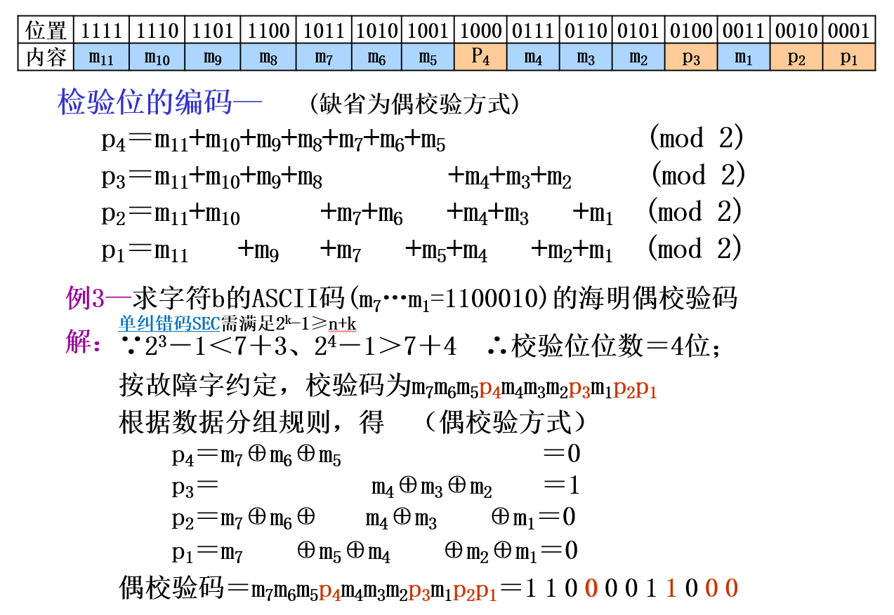
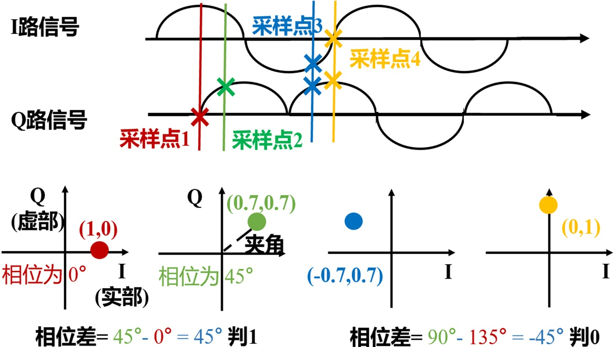

好不容易转了专业，怎么这门课又要学通信……唤醒了一些我认为应该尘封的知识。老师讲的大多我都会，下面的复习给老师的课件做了一些补充。

考试形式：开卷。选择、判断、计算、简答(开放性)：根据一篇论文问

---

【考完后的感想】太简单了…… 白花钱打印资料了。开放题问得过于宽泛，不知从何说起，只能大谈自己的宏观理解。比如“就bit到信号的过程，谈谈你对物理层的理解”，这让我答什么？要是我没得满分一定是题目表述的问题！

老师简直把博士生当小学生考。选择题问“1bit编码为2bit时的编码率”，选项甚至连数字“2”都只出现了一次，就算我没学过也会选吧！他真的我哭死。

# 简答：论文阅读
**《NN-Defined Modulator: Reconfigurable and Portable Software Modulator on IoT Gateways》** 老师自己的文章

跨平台问题 —— 利用现在已经普遍集成在各种设备上的AI推理硬件。将信号处理从专用设备（如 GNU Radio）搬移到通用设备上（ONNX适配了的设备）【哪有什么跨平台，不过是有一群人帮你做了】

因此全文主要论证的是，如何用已有的神经网络算子实现现有**线性**调制算法。【传统算法神经网络化早就不是什么新奇的事。我自己就做过许多】

文章前面说用全连接层去拟合，泛化性很差。所以需要结合通信的先验知识，引出了后面的推导过程。不过这里的FC实验感觉是故意抹黑：

> The training set contains 256 different OFDM symbol sequences, each of which represents 128 input complex symbols. The FC-based modulator is implemented with two fully-connected layers, with almost ∼ 60000 trainable parameters in total.

我请问了，你都知道是线性调制了，干嘛还搞两层？多半中间塞了非线性激活函数，这不是捣乱吗？而且你搞这么大参数干嘛？64-S.C. OFDM 就算不用IFFT，退化到DFT的参数量也就4096；你用了6w个参数，训练集还只有512，明显会过拟合。

-----

文中式(2)很让人迷惑：
$$
S_i[n]=\sum_{j=1}^N s_{i,j} \phi_j[n]
$$
$\phi_j[n]$ 是第 $j$ 个基函数，$s_{i,j}$ 是符号 $\vec{s}_i \in \mathbb{C}^N$ 的第 $j$ 个分量，这个符号应该是待传输bit经过分组与星座映射后得到的点序列。严格来说，对于单载波比如QAM，一个符号就是一个星座图的点；对于多载波比如OFDM，一个符号是所有子载波同时传输一次所构成的完整时域波形块。

按照我学过的知识，“基函数$\phi$”是相互正交的射频信号，比如 $\sqrt{\frac{2}{T}}cos(2\pi f_c t)$。但这里的“基函数”其实是基带信号，得到的 $S$ 也是基带【纠结了我好久；怎么乱用符号！】。比如，对于OFDM，$\phi_j[n]=e^{j2\pi f_j n}$ 是旋转因子；对于BPSK或QAM这种根据星座图直接IQ调制的映射，$\phi_j[n]$ 是一个窗函数（或者叫“脉冲成形滤波器”，实现了升采样+平滑）。所以 $S_i$ 其实是最终星座图上的一个点，下一步是IQ上变频调制与发射。

> 这篇文章自始至终都在谈论基带；实际发射都是IQ变频：
> $$
> w(t) = Im\{S(t)\}cos(2\pi f_c t) + Re\{S(t)\}sin(2\pi f_c t)
> $$
> 减法也对。这一部分用专用硬件实现。之所以只有两路，是因为只能控制电磁波的幅度和相位；因此无论是什么调制，最终都要得到实部和虚部。比如ASK，等效于虚部为0。

式(2)展示的是一个符号到波形的变换，本质是矩阵乘法。如果一次输入多个符号，就需要在时间上“concat”（或叠加），得到多个符号的时域波形。于是文中使用了转置卷积。具体而言，每个位置进行的是单个符号的矩阵乘法，而 stride 实现了时间窗的平移（转置卷积中，stride控制的是输出的步长，而不是输入的步长）。

具体实现的时候需要考虑复数乘法，不过也是很常见的处理了：拆分为四项，最终组合得到实部和虚部。文中为了通用，最后的组合都变成了全连接。于是最终的神经网络结构是：转置卷积+全连接。

但是文章没有任何额外的做法保证学习到的“基函数”正交（比如学习OFDM时）【正交都没提，干嘛叫“基函数”啊！】。估计很轻易就能学到。

定义为神经网络有一个好处：可以补偿其他硬件造成的失真。通过微调实现。其余好处如跨平台和更快，这是别人做的。

不过这种神经网络的调制方式用不到频率调制这种非线性调制上。

# Go Through 所有PPT
## 多天线
经常看到的信道建模都是矩阵相乘，这只能在平坦衰落或没符号间干扰的时候用。
- 平坦衰落：即频域响应是常数，对应时域为冲激函数（可以有移位），表示环境没有“混响”。对立面为“频率选择性衰落”，因为冲激响应不是冲激函数就会导致频域起起伏伏。
- 没符号间干扰：比如用了保护间隔。

**MIMO计算** 例题
每路空间流采用QPSK，符号率为 2 Msym/s
1. 单路空间流的比特率为 $2 \times log_2(4) = 4$ Mbps
2. 2×2 MIMO 可同时传两路独立空间流，总 raw bit rate $=2 \times 4 = 8$ Mbps

预编码：在得到多路信号的复数符号后，发送前的矩阵乘法。本质上是在发送前先调整各路信号 _权重_。

## 校验
奇偶校验：补充一个比特，使得总的“1的个数”为奇/偶数。可以检测单个错误。

纠错码纠出一个错的要求：假设冗余位数为 $k$，原数据位数为 $n$，则错一位有 $(n+k)$ 种情况，加上没错的情况，需要编码 $(n+k+1)$ 种情况，一共有 $2^k$ 个编码，所以需要满足 $2^k \geq n+k+1$。同理，如果要纠出两位错误，至少要编码 $(C_{n+k}^0+C_{n+k}^1 + C_{n+k}^2)$ 种情况

**海明码**：多个奇偶校验一起用，使得可以纠错。提出时为非系统码形式：第 $i$ 个冗余的位置在 $2^i, i \geq 1$，负责检查所有位置编码中第 $i$ 位为 1 的位。比如码长15，则 0010 处会设置一个冗余位，负责维持 `0011` `0110` `0111` `1010` `1011` `1110` `1111` 这7个位置1的奇/偶性。接收时一旦发现奇偶对不上，说明某个“XX1X”位置有错。每个冗余位负责检查不同的位，所以可以唯一定位错误位置。【注意：没有id=0的！】

这个思想很巧妙，有很多脑经急转弯（比如找到有毒的水瓶）就用的是这个思维。不过之后被线性分组码理论统一，显得花里胡哨。

最小码间距离和纠错比特的关系：$d_{min} \geq 2t + 1$，其中 $t$ 是纠错能力。比如海明码的 $d_{min}=3$，所以能纠出一个错误。

**拓展汉明码：** 在海明码的基础上增加一个全局奇偶校验位，使得 $d_{min}$ 从3增加到4，可以更好地区分单错和双错。

题目里最低位应该是左边的

## 卷积码 (n, k, K)
- n: 一次性输出比特数
- k: 一次性输入多少比特/每k个一组
- K: 约束长度，指当前输出由多少个输入比特共同决定

> 某卷积码当前输出由“当前输入比特 + 前2个输入比特”共同决定。
> 记忆阶数m=2（两个移位寄存器），约束长度K=m+1=3

计算：g=111，视为 $g(x)=1+x+x^2$，输入为 `1011` 视为 $s(x)=1+x^2+x^3$，然后多项式相乘模拟卷积。

## 线性调制（基于星座图）
严格来说，OFDM不是调制（Modulation），而是多载波复用（Multiplexing）或一种传输波形（Waveform）。

星座图上一个点为一个 Symbol，Symbol的种类 $= 2^b$，$b$ 为一组bit的数目，也是一个Symbol的信息量。有时候单位给 *Byte*，1 Byte = 8 bits.

Symbol rate 是发射一个符号的速率，单位是 Baud (sym/s)；Bit rate 是发射一个bit的速率，单位是 bps (b/s)。对于 $b$ bits 构成一个 Symbol 的调制方式，$bps = b \times Baud$.

星座判决用最近点的本质？老师给的答案是“欧式距离”，实际上是高斯噪声下的最大后验概率。

QAM的排布方式：相邻的点之间只有一个bit不同，减少误判的概率（格雷码映射）。4QAM第一象限是11，16QAM

## 频率调制
GFSK 中的 G 表示先经过高斯滤波，使频率切换更平滑。高斯滤波的作用是平滑频率过渡、减小带外泄漏，并保持连续相位特性。

具体做法：输入 `0 1 0 0 1 1...` 先过采样得到数字方波 `0000 1111 0000...`，再经过高斯滤波后得到小数，最后经过DAC送给压控振荡器VCO。（FSK可以用开关切换振荡器）

GFSK 解调流程可以概括为：接收 IQ → 求相邻相位差 → 计算瞬时频率判断高/低频 → 判 1/0。

## LoRa (这个之前没学过)
Long Range Radio 物理层本质为 Chirp Spread Spectrum (CSS)。一个CSS符号时间内，频率从某个起始频率线性增加/减少，到上限/下限后跳变到下限/上限继续线性增加/减少。区分不同符号的方式是其起始频率。解调的时候，先混频去趋势、变为基频，然后进行FFT，找到频率峰值位置就知道符号了。

为什么使用CSS？相比于FSK，CSS用到了整个带宽，对频率选择性衰落更鲁棒。

实际设备的 LoRa 频率不是连续的，有一个频率的步进。把带宽划范围为 $2^{SF}$ 个频率点，$SF$ 就是扩频因子 spreading factor。其实要连续变化很容易，只要 DAC+LP+VCO；但数字架构更加低功耗。不同扩频因子的信号彼此正交（斜率不同），因此可以同时发送。

下面推导“频率步进维持时长”。记采样率为 $f_s$，每次采集 $k$ 个点用于FFT，则时间长度为 $T_{sym} = \frac{k}{f_s}$，频率分辨率为 $\Delta f = \frac{f_s}{k}$。为了在频谱中分辨每个起始状态，要求 $\Delta f \leq \frac{B}{2^{SF}}$，于是每个频率步进的维持时长 $T_f = \frac{T_{sym}}{2^{SF}} \geq \frac{1}{B}$。一个关键点：**AWGN信道下，延长步进时间不会带来任何SNR增益**，因为这是频率调制；如果某种噪声会导致频率偏移也服从高斯分布，那才有效，但此时相当于重复发送，是古老无脑的应对方案；而且可能会破坏不同SF之间的正交性（比如时间延长一倍，斜率和下一个SF一样，会造成干扰）。所以这里取等号。

发送端有 $2^{SF}$ 种情况，扩频因子和传输速率的关系：$R = \frac{SF}{T_{sym}} = \frac{SF \cdot B}{2^{SF}}$ 。扩频因子越大，速率越低。一个疑惑：减少实际使用的起始状态能不能增加鲁棒性？但此时不如直接降低SF，因为降低SF后频率间隔和减少起始状态时相同，而码率更高。虽然SF增加导致频率间隔降低，但是时间久了，鲁棒性范围上升了。

---

题目：
- CSS 的基本直觉是：用一个频率随时间线性变化的 _chirp_ 作为载体，并用符号索引对应不同的起始 _频率_ 或循环移位。
- LoRa 接收端常把接收 chirp 与一个 _down_ -chirp 相乘，这一步通常叫 dechirp.
- 选择：下面哪种理解最准确？
    - A. 更大 SF 往往带来更长 airtime（无线信道被某个传输占用的时间）| **对**
    - B. 更大 BW 一定让距离更远 | **不对**，不能简单说更远
    - C. SF 与 BW 对速率无关 | **不对**
    - D. LoRa 不存在速率与鲁棒性的折中 | **不对**，更高的 SF 有更低的速率但更高的鲁棒性
---

不同调制的信息承载方式：

| 调制方式 | 判决依据 | 信息承载于 |
| --- | --- | --- |
| QAM / QPSK | 最近星座点 | 星座落点 |
| GFSK | 相位差反映频率 | 频率偏移 |
| LoRa | chirp 起始位置 | 起始频率 |

## OFDM
一个 OFDM Symbol 包含多个数据子载波，每个子载波的幅度来源于之前的星座映射。

OFDM 在多径场景下更容易均衡的主要原因是 —— 把高速数据拆成多个低速窄带正交子载波，每个子载波更接近平坦衰落。

**发射流程：** 比特→加扰→信道编码→交织→星座映射→数据子载波分配→插入导频→空子载波置零→IFFT→加循环前缀→基带时域信号
- **加扰** —— 把输入比特序列和一个伪随机序列做异或，目的是让输入比特看起来更随机，避免长串的0或1导致信号质量下降。接收端再异或一次就能恢复。
- **交织** —— 打乱顺序，因为实际信道可能出现连续的错误，如果不打乱，可能会导致一个OFDM符号内的多个子载波都出错；打乱后错误分散在不同符号中，更容易纠正。
- **空子载波**：通常用于直流位置、保护频带或未使用频率位置
- **导频子载波**的作用：信道估计和同步
- **循环前缀** cyclic prefix 的主要作用 —— 分两部分：
    - **cyclic** 的作用是减少子载波间的干扰 ICI，利用了循环卷积的性质
    - **prefix** 的作用是减少符号间的干扰 ISI
    加入 CP 后，接收端更容易用 FFT 做基于子载波的处理。也算OFDM符号的一部分。

> 某 WiFi OFDM 系统发送 1500 Byte 负载。计算对象为该负载对应的 OFDM 数据符号。参数：64点IFFT；48个数据子载波，4个导频子载波，其余为空；循环前缀长度16点；64-QAM；编码率3/4；时域复数采样点用I/Q存储，I、Q各12 bit。
> 1. 每个数据子载波一次携带几位编码后比特: $log_2(64) = 6$ bit
> 2. 一个OFDM符号承载信息比特: $48 \times 6 \times \frac{3}{4} = 216$ bit 【注意这里指的是原始信息比特】
> 3. 至少需要多少个OFDM数据符号？$\lceil 1500 \times 8 \div 216\rceil = 56 $
> 4. 最后一个符号需要补多少补齐比特？$56 \times 216 - 1500 \times 8 = 96$ bit
> 5. 一共有多少个数据子载波符号和导频子载波符号？$56 \times 48$ 和 $56 \times 4$ 个
> 6. 加循环前缀后一共有多少个时域复数采样点？$16 + 64 = 80$ 个 【指发射端发射前】
> 7. 保存这些采样点需要多少Byte？$80 \times 12 \times 2 \times 56 \div 8 = 13440$ Byte

## O-QPSK ZigBee
**发射：** _比特流_ → _分组_ → _符号映射_ → _脉冲成形_ → _Q路延迟半个bit时间_ → _IQ调制并发射_
- 符号映射：4个bit变为32个，PN码片，偶数走I路，奇数走Q路。
- 脉冲成形：1映射为向上的半sin，0映射为向下的半sin
- Q路延迟0.5us：使IQ相加时幅度保持恒定，防止同时发生跳变，降低对硬件的要求
- QPSK体现在哪？I路和Q路视为一个复数。不是用一般的QPSK的星座映射，而是直接变波形。所以相当于发了16个符号。

**接收：** _下变频_ → _按码片采样_ → _计算每个点的相位_ → _求相邻相位差_ → _判决为1/0_ → _逆映射_
- 每个半正弦波平均
- 计算每个点的相位：一般用 延迟-共轭-相乘 法，直接得到相位差。
- 相位差判决：相位增加了判决为1，减少判决为0。其实就是在进行QPSK的解调。

## DSSS/BPSK
本题考察BPSK符号映射、Barker扩频和码片序列生成过程。码片是扩频后更细的发送单位。题目采用长度为11个码片的Barker扩频码：$c=[+1,−1,+1,+1,−1,+1,+1,+1,−1,−1,−1]$。比特到BPSK符号映射为：1→+1，0→−1。待发送比特序列为[1,0,1]。
1. 原始比特序列对应的BPSK符号序列是什么？`[+1, -1, +1]`
2. 三个比特扩频后的码片序列分别是什么？$+1\times c$；$-1\times c$；$+1\times c$；总码片数 = 33
3. DSSS/BPSK发射端从比特到发送信号的主要流程：_原始比特_ → _BPSK映射_ → _乘以Barker扩频码_ → _(码片序列)_ → _脉冲成形_ → _(基带信号)_ → _发射_
4. 接收端流程：_接收信号_ → _下变频_ → _采样得到码片序列_ → _11个码片分组_ → _与本地Barker码相关_ → _根据相关值正负判决_ → _BPSK解映射_ → _恢复比特_
5. 接收端若使用同一个Barker码做相关，为什么可以恢复原始比特？接收端用同一个Barker码相关时，正确扩频码得到较大的正相关；取反扩频码得到负相关。因此可以根据相关值正负恢复BPSK符号，再恢复原始比特。

某DSSS/BPSK系统使用11-码片扩频码，每个比特对应11个码片。系统比特率为1 Mbps。这里的码片速率表示每秒发送多少个码片，单位Mcps表示“百万码片每秒”。现在发送1000 bit。每个码片采样2次，每个复数采样点用I/Q两路存储，I和Q各8 bit。
1. 1000 bit对应多少个码片？码片速率是多少？$1000 \times 11$；$1Mbps \times 11$
2. 发送1000 bit需要多少时间？$1000 \div 1M$ sec
3. 总存储量是多少Byte？$1000bit \times 11cpb \times 4Byte$
4. 为什么DSSS中码片速率高于比特率？DSSS把每个原始比特扩展成多个码片，而为了保持和原始信息的同步，要求时间相同。

和 OFDM 的比较：
- OFDM 借助多子载波并行与高阶调制提高单位时间承载量。
- DSSS 通过扩频和相关检测体现抗干扰思想。

## 单天线零迫均衡
均衡发生在 下变频-ADC 后，目的是尽量恢复发送端原来的 _符号_（而不是“信号”），输入为失真符号，输出为恢复符号。

零迫均衡的做法是：把信道建模为矩阵，接收端预测该矩阵，乘上逆就得到恢复符号。这个方法的缺点是：噪声也被放大了，尤其是当信道矩阵接近奇异时。
