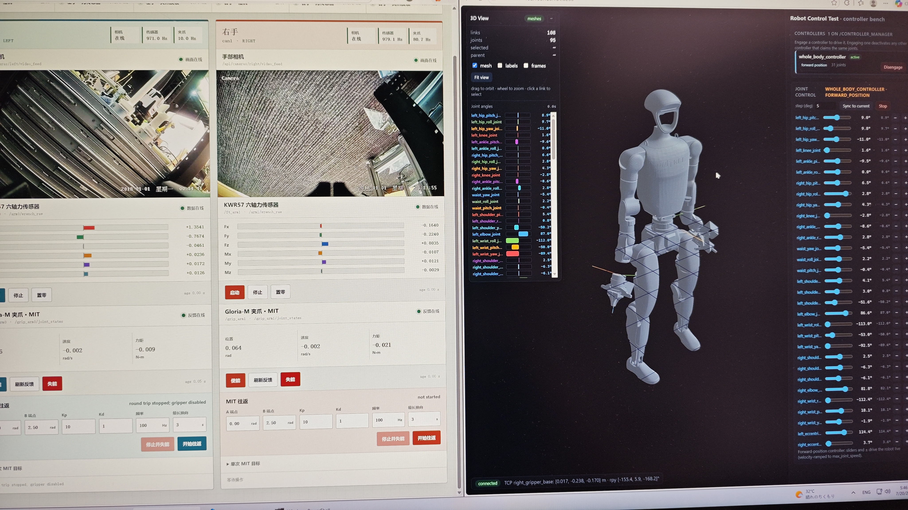
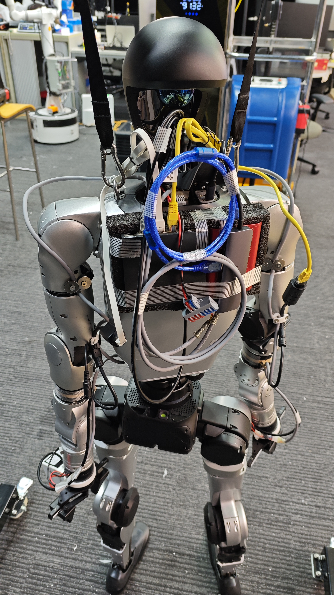

mentor 给我了一个没人用过的 unitree G1，让我先让它动起来。

# 2026/7/8
今天用官方SDK让宇树机器人本体动起来。主要解决了基本环境配置。

## 开机

图片摘自 [G1文档/操作指南/遥控说明](https://support.unitree.com/home/zh/G1_developer/remote_control)

遥控器、机器人开关机都是：短按-长按
1. L2+B 进入阻尼
2. L2+UP 进入预备
3. 松开悬挂绳
4. R2+A 开始控制

要运行自己的控制程序，需要用遥控器进入调试模式。开机后按 `L2+R2` 进入调试模式。调试模式下按 `L2+A` 会让其做出特定姿势（小臂伸出），可以用于验证当前是否在调试，但建议回到阻尼状态，因为电机会发热（机器人靠电池的，不能一边接电一边运行）。

不进入主动调试模式（比如遥控器不见了）也有补救方式：可以程序切换，SDK中有相关的API，而ROS中也有相关的topic。

## 连接与网络配置


G1 内置了两个电脑。PC1 是不能动的，ipv4 为 `192.168.123.161`，是控制信号的接收者；而 PC2 就是一台 Ubuntu 电脑，可以用（从图中可以看出和外部PC无异），ip地址为 `192.168.123.164`。

首先用网线连接，设置windows的以太网地址为 `192.168.123.99/24`，然后用 vscode-ssh 连接 PC2，非常顺利。

在公司内部，连接无线网是很麻烦的，所以 PC2 得用有线上网。通过 `ip addr` 获取了 MAC 让 mentor 去注册了。G1 有两个网口，但 `ip addr` 只显示 `eth0`，这意味着两个物理网口的背后其实是同一个网卡。最终的效果是：ipv4 是固定的，而 ipv6 为 `24` 开头（连上了公司的网络）。

这么看上网走 ipv6 就行了；但是随即发现 DNS 有问题，需要设置一下（可以让ai写死）：
```sh
resolvectl dns eth0 2001:4860:4860::8888 2001:4860:4860::8844
```
此时 `apt` `pip` 之类的都可以用了。

然而 `Github Copilot` 的 api 只有 ipv4，因此需要让ssh反代v4的流量（去年就用过类似的方法让服务器走VPN）。在windows上执行：
```sh
ssh -N -R 1080 unitree@192.168.123.164
```
此时宇树内置PC2测试：
```sh
curl --socks5-hostname 127.0.0.1:1080 https://api.github.com
```
能请求成功！再配置bashrc使得代理自动生效：
```sh
export ALL_PROXY=socks5h://127.0.0.1:1080
export HTTP_PROXY=socks5h://127.0.0.1:1080
export HTTPS_PROXY=socks5h://127.0.0.1:1080
```
此时只是 bash 里面可以用，而 vscode-server 里面还是不行。此时创建 `~/.vscode-server/server-env-setup` 文件（作用顾名思义），内容同上（设置 PROXY 环境变量），重连就行了。

探索至此已经一下午过去了……踩了巨多坑。

有时ssh会异常退出（比如网线松了），此时1080端口还会被占用。应该先找到，再关闭：
```sh
sudo ss -lntp | grep 1080
sudo kill -9 <pid>
```

看 `bash-history` 发现怎么他们安装也用的鱼香ROS


## 操作
PC2自带了一个 `unitree_sdk2-main`，但是疑似用不了。所以从官方仓库clone了最新的 `unitree_sdk2`，编译安装，运行示例程序一次就成功。不过没想到历程里机器人动作幅度这么大，直接一巴掌呼到网线上，把水晶头的卡扣折了😭……于是又用了好几个小时和不稳定的连接较劲……

于是让AI写了个“右手追踪左手”的代码。需要注意左右的电机并不是镜像的，因此有关 `yaw` 和 `row` 的控制，比如手腕的旋转，需要符号反转；而负责抬手的不需要。

## 阻尼和导纳
市场上的机器人分两种：输入为位置和输入为力矩。

工业机器人一般输入位置。和FOC一样，位置控制是对电流（力矩）控制的封装，而之所以不暴露力矩的输入方式，主要是安全考虑：如果持续输出某个力，加之工业机器人的传动比特别大，会导致破坏力惊人（考虑控制频率有限）。而位置控制则只要保证目标位置不会碰到东西即可。

先明确三种控制的计算方式。下面的位置都是标量，表示电机的角度。

### 位置控制的计算方式
其实就是FOC的位置环：

**1、读取反馈**
- 从编码器读取当前实际位置：$ q_{fbk} $
- 对位置微分得到实际速度：$ v_{fbk} $

**2、位置环计算**
$$
e_p = q_{ref} - q_{fbk}\\
v_{ref} = K_{pp} \cdot e_p
$$
至少是P控制，ID都可以加。

**3、速度环计算**
$$
e_v = v_{ref} - v_{fbk}\\
i_{q\_ref} = K_{vp} \cdot e_v + K_{vi} \cdot \int e_v \, dt
$$
一般就是PI控制。

**4、电流环执行**
将 $ i_{q\_ref} $ 作为目标电流，经过FOC生成PWM波驱动电机。


### 阻抗控制的计算方式
**1、读取反馈**
- 从编码器读取实际位置 $q_{fbk}$
- 对位置微分得到实际速度 $v_{fbk}$

**2、阻抗方程**
$$
F_{des} = F_{ref} + B_d \cdot (v_{ref}-v_{fbk}) + K_d \cdot (q_{ref}-q_{fbk})
$$

**3、力环执行**
把 $F_{des}$ 送入电流环。不过AI说工程上会经过复杂的计算：用目标力算加速度，然后算开环力矩，然后位置环/速度环根据编码器实时反馈，计算出补偿力矩，最终力矩合成，送入电流环。

### 导纳控制的计算方式
**1、读取反馈**
- 从编码器读取实际力 $F_{fbk}$

**2、下一帧的位置**
根据目标力 $F_{ref}$，和当前力 $F_{fbk}$，计算出下一帧末端的位置，然后用IK算出其他中间关节的位置

**3、位置控制**
使用位置控制。


两个做法的本质区别为，FOC为串行控制，而阻抗控制为并联。如果给阻抗控制加上位置积分项，通过拉普拉斯变换计算传递函数，可以发现两者能力上是完全等价的。那为什么位置控制走的是串行呢？可能是串行的分层比较清晰，模式切换很方便；而 MIT 要实现这些需要重新设计所有参数，在单层调试复杂度更高。

### 实际演示
mentor 演示了三个工业机械臂上已经取得的成果：

1. 纯位置控制。操作方式为用手拉动同构的小机械臂（由舵机构成），进行密切的位置跟踪。机械臂是推不动的。
2. 阻抗控制，用的是一个特别的支持力控的工业机器人。此时设定好目标位置后，可以推动，撤走外力会恢复，就像弹簧一样。这个机械臂还做了重力补偿，没深究下去。
3. 导纳控制。设置目标力为0，就可以起到示教的效果。是对位置控制的封装，需要加一个力传感器，只有掰末端才可以移动，掰力传感器之前的关节是掰不动的。但是一个问题是用刚体产生目标力时会有震荡（比如要求用一定的力按住黑板）：两帧之间碰到了刚体，下一帧测量到的力会远远超过目标力，因此会迅速撤回，但离开刚体后力又归零，机械臂又朝刚体靠近……本质是离散控制和连续现实的矛盾，难点在于与刚体接触的弹性系数很大。让我想到我之前做过弹簧排版，为了不越界给边界设置了极大的劲度系数，导致梯度下降算法震荡严重；最后用牛顿法求解的，但是不知道这里能不能用。最简单的方法就是加一个柔性的缓冲层，或者在目标力上加一个低通滤波器。

我的想法：控制时，位置信号加上一个误差允许程度（也就是比例系数？），当精度要求高，误差允许范围就小一些，此时步长就小；当精度要求低，误差允许范围就大一些，此时步长就大。这要求上层的控制算法要额外给出一个参数。


# 2026/7/9
将 G1 接入 ROS，并开始上手非宇树部件。做了很多硬件的事。

由于昨天把水晶头搞坏了，今天先做了很久的水晶头。然后发现加装的传感器姿态装错了，右用了好久去理解机械结构并拆卸。最后才开始尝试 ROS。

官方代码仓库只有 `unitree_ros` 明确支持G1，但这是ROS1；实际上，`unitree_ros2` 的 `unitree_hg` 已经支持了人形的机器人。正如[之前的博客](/posts/roboenv/#unitree_ros2)所说，这个仓库接入 ROS2 的原理是定义了各种消息的 `.msg` 格式，只需要编译这一个即可。

然后让AI根据上面SDK实现的“右臂跟踪左臂”，以及之前博客里用ROS2的python接口控制Go2的[代码](/posts/roboenv/#启动仿真的流程)，实现了ROS2版本的跟踪程序。接入ROS的一个好处就是可以用python，每次修改无需重新编译。

我发现当前只有位置跟踪，而 `lowstate` 可以读取到速度、加速度等信息。于是我加入了速度跟踪，即让目标 `dq` 为读取到的值。然而前几秒还好，后面突然开始抽搐，只能紧急关机。这可能是速度读数并不稳定和准确，而受控臂的抖动会影响到控制臂，使得速度读数更加混乱，恶性循环。

## 夹爪（玄雅）
有官方的SDK [Gloria-M-SDK](https://github.com/Synria-Robotics/Gloria-M-SDK)，通过 USB转CAN 的模块被电脑控制。虽然机身上有 UART 接口，但是示例代码里不参与控制，实测拔了无变化，说明只靠CAN控制。

供电是24V，翻烂了文档都没找到相关说明，最后还是问的淘宝客服。实验室缺少该电源接头，于是又手搓了一个新的接头，花了巨多时间。

## 力传感器（达宽）
也是CAN通信，有数据手册，直接交给AI写。

# 2026/7/10
今日主要将力传感器跑通，并开始进行 ROS2 封装。然后旁听了一场技术会议。因为害怕传说中的大风大雨，故走得比以往早，但怎么就毛毛雨……

mentor让我用另一个更加高级的 USB转CAN模块：CANalyst-II，还是红色至尊版。这个模块有两个CAN口，需要驱动，但是pipy上有逆向的版本。由于这个模块的存在，使得ROS2封装无法使用现成的节点。

第一次封装ROS就遇到这种级别的问题吗：一个CAN总线上连着两个力传感器和两个夹爪，或者一个手臂用一个CAN总线。这是一个分层的架构。基本架构是：CAN 总线节点统一管理 CAN 消息，将收到的消息进行分流；每个设备是一个独立的节点，监听特定的topic

# 7/11~12 学了点 ROS2

## python 节点
使用 `colcon build` 的时候，ROS2会使用 `setuptools` 来安装python包。`setuptools` 是 Python 官方的打包工具，`setup.py` 是入口：
```py title="setup.py"
from glob import glob
from setuptools import find_packages, setup

package_name = "can_bridge_ros"
setup(
    name=package_name,
    version="0.1.0",
    packages=find_packages(exclude=["test"]),
    data_files=[
        ("share/ament_index/resource_index/packages", ["resource/" + package_name]),
        ("share/" + package_name, ["package.xml"]),
        ("share/" + package_name + "/launch", glob("launch/*.launch.py")),
        ("share/" + package_name + "/config", glob("config/*.yaml")),
    ],
    install_requires=["setuptools"],
    zip_safe=True,
    maintainer="madderscientist",
    maintainer_email="liruigang20131115@126.com",
    description="Generic ROS2 CAN bus bridge (python-can <-> can_msgs/Frame).",
    license="MIT",
    tests_require=["pytest"],
    entry_points={
        "console_scripts": [
            "bridge_node = can_bridge_ros.bridge_node:main",
        ],
    },
)
```

**`data_files`**：是 Python setuptools 的机制，用于指定包文件夹（用`name`声明了）之外的文件的安装位置。基本格式是 `Array<Tuple<目标文件夹, Array<源文件>>>`。也就是说，包里面各种文件结构其实无所谓，但是安装后的文件结构要遵循规定。比如 `ros2 launch` 的文件夹必须在 `share/<package_name>/launch` 下，配置文件必须在 `share/<package_name>/config` 下。中间的转换就是通过这个字段实现的。

**`entry_points`**：是 Python setuptools 的机制，用于将python模块变成命令可调的形式
    - `"console_scripts"`：入口点类型（固定写法），表示创建命令行脚本
        - `"bridge_node"`：命令名（最终用户调用的名称）
        - `"can_bridge_ros.bridge_node:main"`：模块路径和函数名，表示在 `can_bridge_ros/bridge_node.py` 文件中找到 `main` 函数作为入口点

        最终效果 `ros2 run can_bridge_ros bridge_node` 等效于 `~/ros2_ws/install/can_bridge_ros/bin/bridge_node`，这个文件是生成的一个python文件，开头用 `Shebang` 指定了python解释器（所以可以和可执行文件一样运行），内容就是import并执行了 `can_bridge_ros/bridge_node.py` 的 `main` 函数。
        其实只要 `source` 后，就可以直接用 `bridge_node` 命令了。但实际会在前面加 `ros2 run`，这是一层更专业的封装。


## XML 配置
ROS2 支持用XML作为节点参数，有函数支持。


# 2026/7/13
经过一周末的虚空优化代码后，终于上班、能碰真机了。让 AI 给力传感器写了 web dashboard，但是发现读取并不能达到设定的 1kHz。原本的设计是，一个设备一个节点，节点之间通过 ROS 的 DDS 通信。但是力传感器麻烦的一点在于，六轴数据偏偏要分为三个 CAN 帧发送，导致 DDS 通信频率变为 3kHz，压力比较大。原本的做法是传感器节点接收三个裸 CAN 帧，进行合并灯处理后发布新的数据。为了提升速度，我在 can node 中引入了 hook 机制，让力传感器和 can node 在同一个进程中初始化，将 DDS 通信转为进程内直接传参。这样确实可以让单个节点达到 1kHz。

然后让 AI 写了四个 CAN 设备一起上的 dashboard。不过导线只做了一只手的，只能测试一边。

最后开始做线，将传感器和夹爪正式连在一起、并接到机器人上。下班前一个多小时就花在这上面了……一共有四根线：电源两根，CAN 两根，同一条线缆上的设备并联。

有点不爽的是 mentor 叫我把代码合并到他新开的仓库，但是合并时用 splash 的方式并在合并后删除分支，导致我明明 commit 了那么多次，最后绿格子上只计数了一次……

# 2026/7/14
一早开始做第二根线，比昨晚的美观很多，做了一个半小时。于是——终于可以将四个设备全部接入了！下一个问题是怎么固定导线，因为传感器和夹爪是末端设备，而接口在机器人背部，需要设计线缆在手臂上的走线方案。这很麻烦，因为要留裕量，导致固定点之间凸起了很长的导线，像龙背上的鬃毛的轮廓。

宇树 G1 上面有两组螺孔，估计就是用于外挂固定的。理想方案是打印一个固定的夹具，但是为了方便先用垫片夹住导线。

终于可以上电测试了！但是发现了性能问题：单开一侧的传感器能有1kHz，但是开另一个 CAN 上的传感器后，频率降到了 800Hz，但这两条 CAN 明明独立啊！把夹爪开启后更是下降到了 700Hz。mentor 猜测瓶颈是 USB-CAN 的吞吐量，看来不好解决，于是暂且就这么着，开始准备下一个设备——夹爪上的相机。

这个相机采用网线传输数据，使用 PoE 供电（哇这是装修时学到的），要么用 PoE 注入设备，要么用带 PoE 的交换机。mentor 让我先用注入试试。好在这个摄像头有现成的 ROS2 驱动，让 AI 适配一下就行。

困难的地方在于要我做支架、以固定到夹爪上（夹爪有固定的孔位）。于是重拾了 SoildWorks（已经一年多没碰了！），手忙脚乱赶在下班前建好了一个模型，送去打印。不得不说拓竹的打印机是真省心啊！当年我自己装的打印机什么都要自己做，但是拓竹一套自动化流程给它全包了。也不得不说电子的游标卡尺真难用，示数总是漂移。

# 2026/7/15
一早上拿到了打印完的支架，非常完美地嵌入了相机，角度也刚刚好！但是 mentor 认为连接还不太稳固、连接太脆弱，于是我又加了个环绕夹爪的环以固定，并把壁加厚到 4mm，就这样又建模了一早上。打印结果非常完美~超级稳固！

等待第二个支架打印的时候，我又开始研究到底怎么把频率提上去。让 AI 去分析，AI 写了个C++的分析节点，告诉我实际上都能达到 1kHz；但是 web dashboard 显示远远不到！真相大白了——是 web dashboard 节点统计频率的方式有问题。于是美美修改，合并入主分支。

摄像头全部安装完毕后，接下来就是走线，和之前的线缆一起走。原来的临时方案固定两条粗线有些力不从心了，不过此时已经解锁了3D打印机，于是开始建模、打印！

# 2026/7/16
之前是网线连接；为了使用摄像头，而加入了路由器——即作为交换机，又作为AP。于是先把路由器配置了，实现了无线ssh。目前相机使用 PoE 注入模块供电，最终拖了一大堆东西，终于是让整个末端全部运行起来了。

硬件方面下一步是制作一个背包，将设备全部装进去。提交了采购申请：PoE 交换机、电压模块、电源导线。可惜市面上没有 AP+PoE+交换机 三合一的设备，只有 PoE+交换机。好在我发现内置的PC2可以切换为AP模式，可以省去外面的信号发射，于是设置为了开机自启；又考虑到这增加了耗电，那就关掉桌面系统省省电，为第二天的折腾埋下了伏笔。值得注意的是 G1 连接 app 也会创建一个热点，官方文档说这个热点不能用于远程连接，我猜这是不开放的 PC1 的热点。PC2 的热点是可以用ssh连接的，不过每次 ip 都要用 `arp` 查（虽然应该不会变）。

mentor 说，在等待器件到货的时间里可以开始下一步——进一步封装整个机器人的ros节点，实现在网页上观察机器人姿态，即全身控制——这不就是“数字孪生”嘛！这需要机器人创建一个节点，根据关节状态往外发布 urdf 描述，是行业标准做法。在工业机器人上这是默认有的，但是宇树只能提供 `lowstate`，更何况末端是自己装配的，需要自己封装。至于 dashboard，直接用 mentor 之前写的。

首先要解决 urdf 的预览。mentor 说他用的是 ros2 的功能，这需要桌面环境，所以 ssh 下看不到，还特意给我配置了他 ubuntu 的账号。我当时在用 VSCode 插件 "Robot Developer Extensions for URDF" 预览，但是这个插件默认不是最新版的，导致失败。后来手动安装更新包解决了，不过还有一些小问题；最终还是用了另一个插件 "URDF Visualizer"，这是 unitree 的 urdf 仓库推荐的插件。

夹爪官网给的 urdf 完全挂羊头卖狗肉，服了。好在我发现官网提供的 STEM 文件是对的，于是在家自觉加班初探格式转换，也大致懂了 urdf 到底是什么——本质和 mujoco 用的 xml 差不多。但是原生 urdf 只能建模树形结构，对于夹爪这种曲柄连杆的闭环机构，是无法建模的（AI说的）。明天问问 mentor 吧。

# 2026/7/17
mentor 说 urdf 其实是可以表示联动的，给了个例子。于是让 AI 照着例子帮我实现了，但实现得较为丑陋，基本原理并不是关节的物理约束，而是位置的拟合，输入是主动关节的角度，其他link的位置直接用“样条曲线”的思想拟合，导致多出了许多虚拟关节（因为关节位置拟合都是线性的）。对于夹爪滑块，这很简单，只要角度转位移；连杆一端跟着滑块平动，另一端在主动轮上，是圆形的运动轨迹，AI 就给我用8个虚拟关节进行拟合了。

准备导入真机时发现，G1 的 ssh 连不上了，但是能 ping 通。直接连接屏幕也是“no signal”。重启后发现屏幕在 boot 的时候会亮，可以正常进入 boot 设置，但是之后就无信号了。说明进入 linux 系统后切断了输出。我知道这和我昨天的设置有关，应该就是热点的开机自启导致网络出问题、关闭桌面系统导致不输出图形信号。不过按理来说应该也会显示一个 cli 啊？

折腾了很久，人工转述给 GPT，GPT 给了许多步骤但都没起效。都准备刷系统了，GPT 让我试试浏览器直接访问 G1 的 ip 地址——竟然有一个Vue网页！里面还有“recovery latest version”，虽然不知道这是什么的 version，但死马当活马医，运行后竟然可以 ssh 了！赶紧把桌面系统开启，于是显示器也有输出了。赶紧撤回了昨天的修改，历经4个多小时，终于恢复正常。

最后让 AI 排查了一下原因，发现很让人无语：自启热点卡死，于是 ssh 的开启被阻塞；疑似是 jetson 的问题，不做额外的配置就是不能单独输出 cli。

之后顺利地成了整个机器人的 urdf 组装，学会了 `xacro` 和 `urdf` 的关系：`xacro` 用宏的方式拓展了 `urdf`，使得复用时更加方便（urdf中不能有相同的name），编译为 `urdf` 就是宏展开的过程——替换文本。让 AI 告诉我模型仓库作为 submodule 导入到 ros 工作区应该放在哪里，结果 AI 看到有一个dashboard，哐哐给我把适配也写完了，周一再看看效果吧。

这周过得真快啊！

# 2026/7/20
让AI把 urdf 接入了dashboard——可以在网页上看到整个机器人的姿态了！


然后让 AI 对接了 dashboard 的控制接口。由于宇树机器人使用 MIT 协议控制电机，相比于工业机器人这种位置式的控制，除了目标角度，还需要提供 `kd` `kp` 等参数。我想到 `unitree_rl_mjlab` 里面就有 G1 行走的训练，看代码发现神经网络直接输出的是关节的角度，其他参数使用了固定值，便直接抄了下来。

采购的东西到货了。PoE 交换机额定供电电压为 53.5V，原计划使用 Unitree G1 的电池供电，根据文档，其电压为58V，所以买了个降压模块。但是遇到了两个问题：
- 机器人电池电压随着电量的降低而下降，开始报警的时候只有 46V；刚充满电的也达不到 58V，只有 54.5V。
- 实测降压模块最大输出依然有约7V的压降，且输出会随输入电压而线性变化。

所以降压模块是不能用了。那能不能直接接入？好在实验室有一个直流稳压电源，实测降低到 30V，这个 PoE 路由器依然可以正常工作；稍微加了点电压（mentor原话：随便试，又不值钱），发现依然能工作！神了。于是直接接上 G1 的电池直供口。

现在路由器和PoE注入都可以下岗了。那怎么连接呢？考虑到 G1 自启热点遇到过问题，而之前已经配置过了路由器，所以改为让 G1 连接路由器的无线网，保持路由器常开。此时遇到一个问题：如果 wlan0 和 eth0 在同一个网段，会有连接问题，这不得不注意一下。于是将路由器的子网掩码设置得大了一些，让交换机直连的设备成为子网。

# 2026/7/21
一大早先解决连线问题，让机器人彻底独立。mentor 的意见是打印一个盒子背在后面，而我发现当前的问题主要是路由器和 CAN 模块没法固定在机器人上，未必要完整的盒子。刚好今天有领导视察，mentor 整理实验室的时候翻出一些包装剩下的珍珠棉，被我留了下来。本想用来打个草稿，就找个厚一些的挖空了中间，把交换机和CAN模块塞了进去，戳两个洞就拧到机器人后背了——效果竟然还不错？一番调整后就把所有线都理好了:


为了演习下午可能要给领导展示的 G1 运动（实际没有展示），测试了一下遥控器的功能。只听得机器人重重地剁地，着实不敢随心所欲地操作。可能是背了东西的缘故，机器人重心偏后，后退时总像要摔倒。之后自己训练可能要增加对重心在中心的奖励。

下一步就是让下半身维持平衡、上半身封装为“输入末端位姿”控制的模式。下半身我的设想是用强化学习和域随机化；先解决上半身，基本思路是先用 IK 算出各个关节的目标角度，然后执行。mentor 又给我了一个 IK 包，要我对接，最终效果是其 dashboard 中可以直接移动末端。发现这里用了很多 `ros2_control` 的东西，而这我闻所未闻。

简而言之，`ros2_control` 是 ROS2 的一个控制框架，目标是让模块可以在异构机器人上迁移。为了实现这个目标，就需要制定一个中间标准，向下要求硬件驱动遵守，向上约定调用方法，这样上层算法模块就可以忽略底层的差异。实际上，如果都是自己的机器人和代码，完全可以自己定义这个标准，不需要使用这个框架。
这个框架的基本结构为：启动一个 `controller_manager` 节点，可以往里面注册 `controller`，这个 `controller` 向上暴露，向下控制硬件；`manager` 会统一管理所有的 `controller`。`controller` 的创建方法是继承一个 C++ 类，本身并不是 ROS 节点，但内部可以创建节点、维护其生命周期，进而监听、发布话题，实现对外的通信。那我有一个问题：本来我直接向硬件节点发送 DDS 消息，现在变成了先向 `controller` 发送，再由 `controller` 向硬件节点发送，看起来没有任何好处。实际上，如果 `controller` 控制硬件就是直接向硬件的节点发送 DDS 消息，那确实意义不大。但 `ros2_control` 体系中还给硬件指定了接口 `hardware_interface`，硬件节点必须实现这个接口，`controller` 通过这个接口控制硬件。这样就将硬件资源管理起来了，此时就可以避免竞争关系，比如防止两个控制节点同时向一个硬件节点发送控制消息。
为了获取受控硬件的信息，`controller_manager` 的启动参数需要提供 `urdf` 文件，但是只关心 `<ros2_control>` 里面的内容，里面声明了硬件资源。实际操作中可以把 `<ros2_control>` 用宏的形式加到标准 urdf 中。

学习了这么多，看起来当前的架构要大改了。昨天 dashboard 不是跑起来了吗？我不记得有写过 C++ 的 `controller` 啊？一检查才发现 AI 给我写了个鸭子类型的控制器，骗过了调用者。嘚，这下全部得改了——即使是等 AI 也很累啊！

# 2026/7/22
AI 修改后有一个问题：控制着控制着就突然不动了。这是因为夹爪的反馈延迟比较大，应该加入特判——但不至于延迟这么多啊！于是让 AI 一路溯源，发现是底层的问题。

# 2026/7/23
AI 把底层修完了，用 C++ 重写了 CAN 通信层，tql。
AI 把 IK 接入了，但是有很多问题

# 2026/7/24
原来发布 urdf 的是一个 ROS2 包，叫做 `ros/robot_state_publisher`。发送的 urdf 也不是周期性发送，而是缓存，每一个订阅的都会立即收到；主动发送仅当 urdf 发生变化。所以发送的 urdf 是静态的，不包含位置信息。只要 launch 的时候把这个包启动起来就好了。

这个包的作用是：输入 urdf 和实时关节状态，输出各个 link 的 TF。TF 描述的是 link 的坐标系之间（父子）的平移和旋转，urdf 里规定了link坐标系下 mesh 的放置。

IK 修好了，但是此时末端够不着目标位置。这是自重导致的，所以决定下一步做重力补偿。

# 2026/7/27 自动重力补偿标定
把重力补偿做了，效果非常惊艳！

由于机器人末端经过改造，首先要进行质量标定（就算没改造也要标定）。先采集一些点，每轮迭代先用当前参数到逐个点上算误差，在用最小二乘法进行参数估计更新参数。重力补偿根本原理为对电机的力矩进行偏移，考虑到稳定性的因素，不应该作为偏置项，而是应该折合到目标位置。

标定结果实际使用时发现容易过度补偿。一方面是种种原因把质量估计大了（比如把摩擦力等效到质量了），但我懒得改，于是增加了一个“补偿比例”，只要手动调整到合适的值，再用这个值缩放质量就行。

进一步制作了重力补偿控制器，现在 IK 中在空载的情况下可以达到预设的位置了！重力补偿单独作为一个 controller，负责将重力补偿力矩折算后的目标偏移量加到输入的目标位置上，然后发给底层的 FPC。

# 2026/7/28 环境升级
思考怎么做上下半身解耦的控制器，难点在于怎么兼容到当前系统中。我其实很想让重力补偿作为一个单独的 controller，但是问了 mentor 和 AI，都建议把重力补偿作为底层控制器的一个开关，而不是控制器分层。

在调研时，我发现 ROS2 foxy 功能不够，升级到 humble 会带来很多好处。于是先去忙活迁移的事。这大概是第一次无指导使用 `docker`（之前课上都是照猫画虎点到即止），好在有 AI，但也遇到了很多问题。目前的做法是文件夹直接挂载到容器中。最麻烦的是网络，因为机器人电脑靠 ssh 反代上网（公司网不让私接AP），就连 AI 也要折腾很久。

# 2026/7/29 尝试内置的下半身平衡
正式把重力补偿融入了底层控制器中，还修复了迁移引起的 ctrl-C 自动失能失效的问题。

然后测试了 unitree-G1 自带的下身控制，发现如果接管上身，下身就只能保持平衡，不能行走（但可以被动行走，即推它走）。本来计划写一个控制器，下半身就交给宇树内置程序控制，但如此一来若要移动先得放手，连端水杯都不行。虽然 mentor 让我先用状态机做了，我还是决定先训练一个下半身行走的神经网络。这一方面我在校时用官方代码训练过 Go 的行走，对框架已经有一定经验。让AI直接根据重力校准后的urdf、以及已有的官方示例，改写成 mujoco 版本。下班前让 AI 托管了后续训练。

# 2026/7/30 下肢强化学习
一早看到 AI 训练了好几轮，每一轮都会做出修正，很棒！此时已经能走，但是还有些问题。

我们的目标和官方的训练代码有些区别。官方示例是无腰机型的全身的速度跟踪，而我希望最终通过四个量控制下半身：平面速度 `v_x`、`v_y`，角速度 `w_z`，以及高度 `h`，目的是稳稳承载住上半身；上半身将被VLA操作，主要负责操作和负载。我决定只训练下半身以及腰部三个关节，而上半身充当扰动，会被施加随机力、力矩和负载。

在 G1 自带的 /armsdk 中，腰部是划分到上身的。现在的 VLA 只能给出两个末端的位姿和夹爪状态，若将腰部划分到上肢，有两种使用方法：
1. 直接写死，即 PD 参数给大一些。需要调参。
2. 计算 IK 的时候纳入腰部。为了让腰部尽量不动，需要给额外的惩罚，让 IK 尽量不动腰部。

我一开始是懒得调参，所以全部交给了下半身的神经网络，设计腰部奖励时，依然用“尽量固定”的目标。训练时发现机器人容易走偏。我认为是下肢行走产生的力矩带来的全身偏转。如果能控制手臂，手臂的摆动可以抵消走路的力矩；我猜这也是为什么官方的上肢操作和行走互斥——没有手臂的摆动，下肢走不稳。现在没有手臂，但我们有腰！可以依靠 waist_yaw 扭腰抵消。将该关节的惩罚权重降低后，效果果然好了不少。这么看来，将腰部归属到下肢控制又省心又巧妙。

“高度”的控制使得原本腿部“弯曲程度小”的目标不再合适。虽然此时训练结果能跟踪高度，但机器人并不会站直，膝关节始终有角度，导致耗电增加。今天没有管，以后要做可以把大于某个值的控制高度视为“站直”，此时加入对膝关节弯曲的惩罚。

由于允许膝盖弯曲着走，早期训练时发现机器人学到了蹭着地走，于是还加入了脚离地的奖励，这样总算让机器人能踏步了。

为了让静止站立时不跺脚，我设计将速度小于某个值时视为“站立”，此时惩罚运动。这让机器人在被吊起来后非常安静，而 G1 内置的平衡模式在此时会乱蹬。

从头训练如果一开始就加入扰动，会导致入门困难，所以需要循序渐进。最初的做法是当一定比例的机器人满足某条件后，进入下一阶段的扰动。后来发现在大扰动下训练会让机器人倾向于不动，即“站稳”比“跟踪速度”更重要，反而影响了结果。所以我把加扰水平设计为一个参数，每个阶段只修改加扰水平的上限，每个子场景的加扰程度会在范围内采样，这样就能让训练中什么难度都有，难度加大只是提高了高难度场景的比例（而不是全部进入高难度），机器人便不会忘记之前简单情况下的训练结果。

在继续训练时，让 AI 完成了实机部署。用一早上得到的模型进去，发现机器人上肢会抖（发出很大声音），以为是 sim2real 的难点所在，排查了很多地方，之后新训练结果出来后才发现原来是模型还没收敛。之后的模型在“站稳”这方面都特别稳，比官方的还好；不过官方的身体更加挺拔，而我的为了抗扰（我猜）让躯干前倾并弯膝，看起来有些猥琐（也耗电）

一天就完成了 rl 训练+真机部署，非常自豪！

# 2026/7/31 VR接入
昨天 RL 是一边训练一边观察一边调整的，最终的模型起码经过了三次继续训练。昨晚用最终的代码从头开始训练，但是效果极差。尝试了以下的方案：
- 一开始就加入不平坦地形。发现根本学不会，最终删了
- 在尝试不平坦地形时，发现直接学走学不会，就设计了“先学站后学走”的课程。但是发现不平坦地形下连站都学不会。后来删去地形后，发现训练到后面不会走，很可能是因为一开始大比例学站导致的，最后也撤回了。
- 撤回后机器人行走还是蹭地，这是昨天第一版遇到的问题，但是解决这个问题的奖励函数没删，忘了多了哪些新的奖励，不知道为什么。
- 加了对偏航的惩罚，但是疑似没有用。

昨天的多个有各自问题的训练脚本的接龙，打败了最终面面俱到的一个脚本，令人唏嘘。昨天相当于人工动态定制课程，见招拆招，确实不是写死的预制课程可比的。

还有很多细枝末节的调整，总之都没有效果。最终让 AI 自己找问题了，看看两天时间能不能解决了。

下午把上肢 IK 加上了，然后开始接入 VR 遥操。组里正在遥操采数据的是基于 SteamVR 的，但是我很讨厌 Unity。问了 AI 得到了一个吊炸天的方案：用 WebXR 获取数据并转发。基本原理：WebXR 是获取当前主机的 VR 数据的，所以是运行在 VR 头显的浏览器里的；获取数据后，再用网络往外发。具体流程：
1. 用 `adb reverse` 构建一个从 VR 头显到 PC 的反向通道。这一步的效果是，VR 头显访问 `localhost` 会被 ADB 转发给 PC。需要 `localhost` 是因为 WebXR 只允许在安全上下文内进行，如果直接访问 PC 的 IP 地址的网页，会无法获取 VR 数据。这一步使得头显上的所有网络请求都只要往 `localhost` 发就行了。不过如果 PC 有 HTTPS 倒也可以直连。
2. 在 PC 上运行一个 Web 服务器，作用有：
    1. 收到 GET 请求（头显访问 localhost 的网页的请求被转发到 PC 的 Web 服务器）返回含有 WebXR 的网页
    2. 头显打开上述网页后，会主动向 localhost 发起 WS 连接请求，被 ADB 转发到 PC 的 Web 服务器建立连接
    3. VR 数据的转发，包括主动 WS 推流、保存状态供 GET 查询、主动发起定时 POST，是给其他程序使用的
3. 头显侧打开浏览器访问被代理的 `localhost`。由于头显内打字太慢，所以可以让 PC 用 `adb -s <VR IP>:<REVERSE PORT> shell am start -a android.intent.action.VIEW -d "http://localhost:8000"` 让头显打开网页并访问地址。
4. 网页内通过 `session.requestAnimationFrame` 获取 VR 数据并主动发送

惊为天人的流程！

# 2026/8/3
上午依然在尝试复现 RL，终于找到一个版本可以比最初的效果还好了！于是继续迭代。

下午把 Meta Quest2 的头显接入了。这次直接配置了 https，直接访问 Unitree 的 IP 地址即可。但是 IK 还是有些问题，经常抽搐。

让 AI 优化了一下当前架构，把 http 请求直接换成 ros topic，减少了一跳；由于夹爪比较宽，修改了准备姿势的角度，让末端不会打到机身。

有一个恼火的问题：下肢运行平衡、上肢进行 IK 跟随时，经常动不动就进入保护状态，必须重启恢复。让 AI 排查发现只有腰部的电机进入了 `motostate=0x200` 的状态，但官网没有任何此类信息。【发现问题原因在5号】

# 2026/8/4 IK学习
依然在提升 RL 性能和稳定性；写了个 VR IK 的 dashboard。

## 学习 IK 的基础知识
IK 求解分为解析解和数值解两种。设关节的角度 $\vec{q} \in \mathbb{R}^n$，输出为末端位姿 $\vec{x} \in \mathbb{R}^6 (\textit{SE(3)})$，则正向动力学为 $\vec{x} = f(\vec{q})$，求导保留一阶量，一阶导就是雅可比矩阵 $J = \frac{\partial f}{\partial \vec{q}} \in \mathbb{R}^{6 \times n}$，方程变为
$$
\Delta \vec{x} = J \Delta \vec{q}
$$
两侧除以时间，可以发现 $J$ 其实是关节速度到末端速度的变换。现在让左侧为当前和目标的误差，只要两侧乘以逆 $J^+$，就可以得到关节的增量。

这里最难的一步在于求逆。如果自由度恰好为6，直接求逆。但如果自由度不是6，就要求伪逆。在自由度更多的时候，为了得到唯一解，一般选择最小化某个指标。这里可以选择最小范数解（从当前状态出发，移动最短距离），即
$$
min ||\Delta \vec{q}||_2^2 \quad s.t. \quad J \Delta \vec{q} = \Delta \vec{x}
$$
用拉格朗日乘子法可以得到闭式解：
$$
\Delta \vec{q} = J^T (J J^T)^{-1} \Delta \vec{x}
$$
这里涉及求逆，会遇到奇异值问题。为了解决这个问题，可以使用阻尼最小二乘法（Damped Least Squares, DLS），即在求逆时加上一个阻尼项 $\lambda^2 I$，其中 $\lambda$ 是阻尼系数。阻尼系数的选择需要根据具体情况进行调参，过大可能导致解不准确，过小可能导致不稳定。

另一个方法是奇异值分解（SVD），将 $J$ 分解为 $J = U \Sigma V^T$，其中 $U \in \mathbb{R}^{6 \times 6}$，$V \in \mathbb{R}^{n \times n}$ 是正交矩阵，$\Sigma \in \mathbb{R}^{6 \times n}$ 是对角矩阵。伪逆的计算公式为 $J^+ = V \Sigma^+ U^T$，其中 $\Sigma^+$ 是 $\Sigma$ 的伪逆。由于 $\Sigma$ 是对角矩阵，所以伪逆只要将非零元素取倒数即可。接近奇异值的时候，对角线元素会很接近零，此时可以设置截断阈值，只求大于阈值的倒数。但这个阈值需要调参，太小会导致不稳定，太大会损失自由度；且计算开销比较大。

值得注意的是，雅可比矩阵和当前位姿有关，之前的求解都是在切平面上进行的，所以需要迭代。DSL 方法的每一步虽然不如 SVD 精准，但也更加安全。这个过程理解起来非常像梯度下降：从当前位置出发，每次朝着最优方向移动，直到收敛。所以实际使用就把当前机械臂姿势作为初始值，每次迭代就是无形的试探（有些像“世界模型”：估计了转动这么多后会处于什么位置），何尝不是闭环。

还有一个问题：关节有范围约束，此时怎么求？每次迭代后 clip 即可。

但是即使是 DSL 方法，实际应用时往往进入非常奇怪的姿势而无法恢复。这正是因为每次都是在上一次的基础上进行移动，而每次移动的准则只是“最小化关节增量”，并没有考虑全局姿势的合理性；甚至在跨过奇异点后，很有可能就走不回来了。最明显的奇异值来源于三个关节：大臂的扭动、肘关节、小臂的扭动。当肘关节平放，大臂和小臂的转轴共线，就损失了一个自由度，后续肘关节就很难弯折。

既然如此，可以加入“距离参考位置最小化”的优化目标，来实现全局姿势的约束。我灵机一动：这不就相当于每次求解都从参考位置出发吗（其实不等价）？于是写了一个版本，上机一试——手臂直接高速甩动、甩到柱子上打断了夹爪 ┭┮﹏┭┮ 问题很好理解：冗余自由度导致距离参考位置最小化的解有多个，但这些解之间的差异可能非常大，导致末端移动一些，就可能变到遥远的另一个解上，导致极大的运动幅度。

所以还是需要从上次的位置开始，有记忆地迭代。那直接把距离参考位置作为另一个优化目标？但同时最小化两个目标是几乎无解的。那迭代的时候让关节姿势向参考位置靠拢？这会导致对抗，反而不利于收敛。

询问 AI，得到了用“参考位置”的方法：零空间投影法。对于一个矩阵 $J$，零空间（null space）指的就是所有能被 $J$ 映射到零的向量集合。假设当前位姿下有一个零空间中的移动 $\Delta \vec{q}_0$，则叠加到伪逆算出来的关节增量上不会影响末端求解结果；但 $\Delta \vec{q}_0$ 实打实改变了手臂的姿势！因此，只要在零空间让关节姿势趋近参考位置，就能实现全局姿势约束。
实际实现的时候并不是直接在零空间求最靠近参考位置的增量，而是把“和参考位置的偏差”投影到零空间上，得到 $\Delta \vec{q}_0$，然后叠加到伪逆算出来的关节增量上。

然而模拟的时候发现这会带来精度和迭代次数问题：如果每一步都用零空间调整位姿，稳态误差会导致永远不收敛。所以 AI 给出了非常神的方法：只有偏离参考位置一定范围才使用零空间调整，且调整幅度和距离成正比。我只限定了肘部三个关节。

此外，为了防止疯狂甩手臂，还加入了“关节速度限制”，也就是每一帧实际的目标位置并不是VR给出的位置，而是在最大速度范围内的最接近位置。至此，这个 IK 终于能稳定地使用了。

# 2026/8/5 改造G1电池
昨天实在被莫名其妙进入保护状态弄得心烦意乱，今天进行了尝试：只开上肢，不开下肢（因为 waist 关节归属下肢），发现完全不会有问题，说明很有可能是腰部过载。这和当前 policy 有关：喜欢俯身。所以优化 RL 的时候明确加入了上肢垂直的相关奖励。

RL 到后面有一个问题：某个方向的转弯比另一个方向好很多。前几天已经让起始步相随机化了，但依旧没有解决。理论上策略应该左右对称，所以加入了 rl_rsl 的镜像训练。这确实有效，走偏明显改善，但是迈步更晚，同一时期的速度也更慢。

dashboard 有 bug，VR 给出的目标位置也有问题，整个架构也不对，让AI修复。

临近下班和 mentor 尝试改造 G1 的电池。现在在 G1 上开发最大的问题是经常没电，从而要关机换电池。G1 的电池特意设计为供电和充电口在同一侧，天生不能一遍充一遍放；我们的目的就是改造为可同时充放电的方案。拆解过程参考了视频《“我承认你们中国机器人有优秀的地方🙄”日本专家拆解宇树G1机器人：不是你们哪来的脸皮对中国机器人评头论足啊》，乐。
G1 的电池充电口是 `XT30 2+2` 的口，有通信线。我们先尝试只接电源线，发现充不进电。然后在电池侧发现通信口和负极之间的电阻为0？？不理解到底用了什么协议。
于是尝试第二个简单的方案：把充电口引出来，使得电机插入机器人后可以暴露出充电口。这个方案只怕 BMS 设计为充放不可同时的模式。然而整个过程非常顺利：即使没有给电池开机，在充电模式下，也能给机器人供电。所以我认为放电口的通信只是用于告知机器人电量、告诉电池是否插入的，而不是进行校验（没有插入机器人，电池是进入不了放电模式的；当然现在发现充电的时候会进入放电模式）。此时用万用表测量 G1 的电池直通口电压，得到的是电池电压而不是充电器电压，说明电是从充电器流过电池，再给机器人供电的（串联，而不是机器人和电池并联），说明 BMS 本就支持同时充放。此时拔掉充电机会直接断电；如果先开机电池，再开始充电，拔掉充电器后仍然能正常供电。